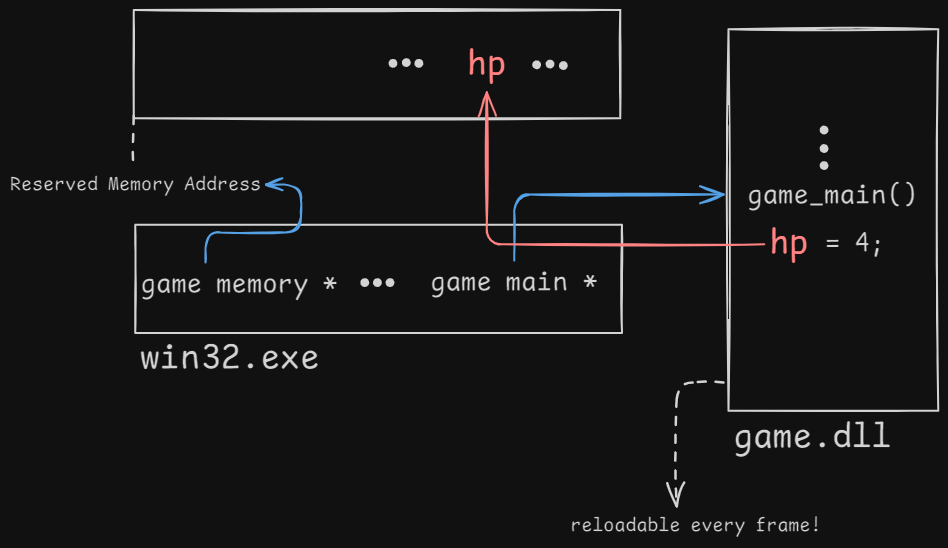

# Build System
I use a single batch file, `build.bat` to handle my build process. Simple. Happy.
> What does CMake do?  
> They make make files.  
> ...Then what does make files do?  
> They make... files.

In my build system, each invocation compiles no more than a single compilation unit at a time. This is known as a Unity Build, which shouldn't be confused with the Unity game engine. Unity builds are commonly used in the game industry.

My build process consists of two main lines. One builds `win32.exe`, and the other builds `game.dll`. The `game.dll` contains platform-independent game code, while `win32.exe` is Windows-specific code that loads `game.dll`. Cleanly separating platform-dependent code from game code minimizes round-tripping and is key to achieving successful cross-platform development.

# Hot Reloading

> Scared of diagrams? Believe me, so am I. OOP's class hierarchy UML diagrams are my worst nightmare. 

In simple terms, win32.exe checks the write timestamp of `game.dll` every frame. 
If it has changed, it loads the updated code. Since the game state is stored in a reserved memory chunk, 
allocated by `win32.exe`, reloading `game.dll` into any arbitrary memory address won't break anything. 
This way, you don't have to shut down the process to modify the game code!

**Be proud of yourself!**  
Once, an entire company tried to achieve, only to fail miserably.

