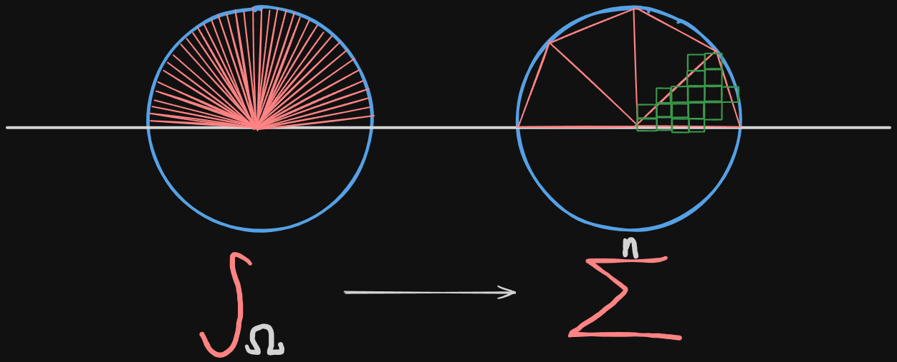

I wanted smooth, beautiful shadows in my game. So I googled it and came across the shadow map technique, which is simply a buffer 
rendered in light's perspective. But what if there are hundreds, thousands of light sources?
I was curious if there are better, advanced techniques for my engine. It was hard to find out options on the internet. The portion of people who work on 
game engine rendering, even among real time rendering and graphcis programmers is minimal. I didn't even know the right keyword to search for. 
Then I decided to read the famous, "Physically Based Rendering" book. Unfortunately, it wasn't the book 
I was looking for. As a beginner, I needed 'Introduction to Lighting 101'. After skimming serveral other books, I finally figured the keyword I longed for...  

# Global Illumination

Global illumination is a huge deal in game development, especially for real-time rendering. Ray-Tracing, Light Probing... there are numerous techniques. 
For my game engine, I chose **Sparse Voxel Octree Global Illumination (SVOGI).** It took me a month of hard work to get reasonable results on the screen.
The two biggest challenges were:

1. Understanding the theory from papers and books.
2. Implementing it using a graphics API.

The idea is simple. First, voxelize the scene at the desired resolution.
Then, instead of using the integral over the hemisphere form in the rendering equation, you can convert it into a summation by using ***Voxel Cone Tracing*** to sample discrete voxels.

>Image of converting integral to summation.

I hope you feel the same tingle I felt when I first read this!  
Computing extremely granular samples all over the hemisphere? Go nuts if you are rendering a Pixar movie. But in real-time rendering? Meh...  

...  

I'll share the resources that I found personally helpful.  
1. [OpenGL Insights - Chapter 22. Octree-Based Sparse Voxelization Using the GPU Hardware Rasterizer](https://research.nvidia.com/publication/2012-07_octree-based-sparse-voxelization-using-gpu-hardware-rasterizer) (❤️)
2. [GPU Gems2 - Chapter 42. Conservative Rasterization](https://developer.nvidia.com/gpugems/gpugems2/part-v-image-oriented-computing/chapter-42-conservative-rasterization) (❤️)
3. [Real-Time Global Illumination Using OpenGL and Voxel Cone Tracing](https://arxiv.org/abs/2104.00618) (❤️)
4. [Comparing a Clipmap to a Sparse Voxel Octree for Global Illumination](https://publications.lib.chalmers.se/records/fulltext/249762/249762.pdf)
5. [Interactive Indirect Illumination Using Voxel Cone Tracing](https://research.nvidia.com/publication/2011-09_interactive-indirect-illumination-using-voxel-cone-tracing)
6. [Physically Based Rendering](https://www.pbrt.org/)
