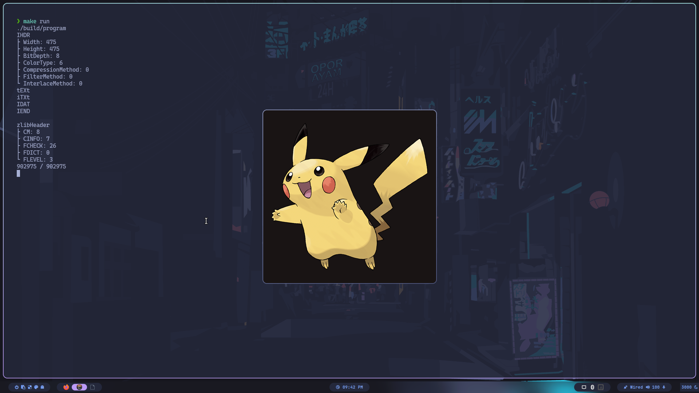

Whilst doing game dev, using image is inevitable, and PNG is a widely-used image file format.  
Why not code from scratch to load PNG? I mean, how hard could it be? It's just bunch of pixel data.  
Am I Right? ...right?  

# Compression
> "First time sucks." -Dijkstra, maybe.

PNG loader is my first 'build from scratch' project in C/C++. I was super-excited to finally build something useful. Sadly, the excitement didn't last long. 
I had to go through the documents explaining compression and filtering algorithm used in PNG. This was my first technical paper experience, and yes, it sucked. 
I felt stupid. I had to read over several times just to find out nothing has changed and not a single line of code did I typed in. Now I know, those papers and documents 
don't really care about you, and you have to fight for the knowledge you crave. But back then, I felt miserable.  
Then, I found this [Youtube video](https://youtu.be/oi2lMBBjQ8s?si=5qhUmQQKNzpKztCl) of explaining the compression algorithm. 
I don't know what savior means if he ain't a savior. [This](https://youtu.be/EFUYNoFRHQI?si=WnFSutqHiN1vD5j7) is also a helpful resource. 
Finally knowing what was going on, I still had code to write: low-endians, high-endians, bitwise operations... as I said, 
the first time sucks. And speaking of bits, there was no room for mistakes. A single wrong bit, and you are done. You will get a hideous magenta Pikachu on your screen.  

Finally, long after the struggle that seemed to never end, a wild Pikachu appeared!

  

> I use Arch, btw.

Finally, for those who are intereted in code, I'll leave a link below.  
[Github Link](https://github.com/raylee9919/png-from-scratch)
