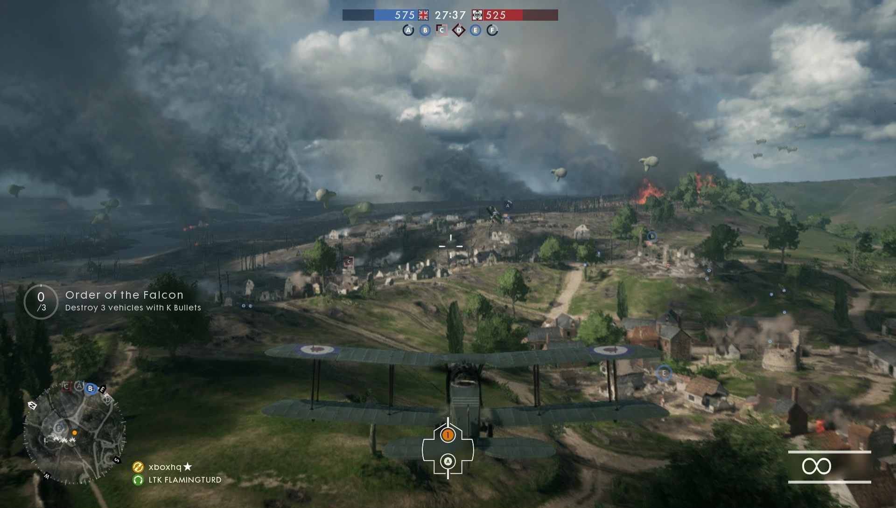
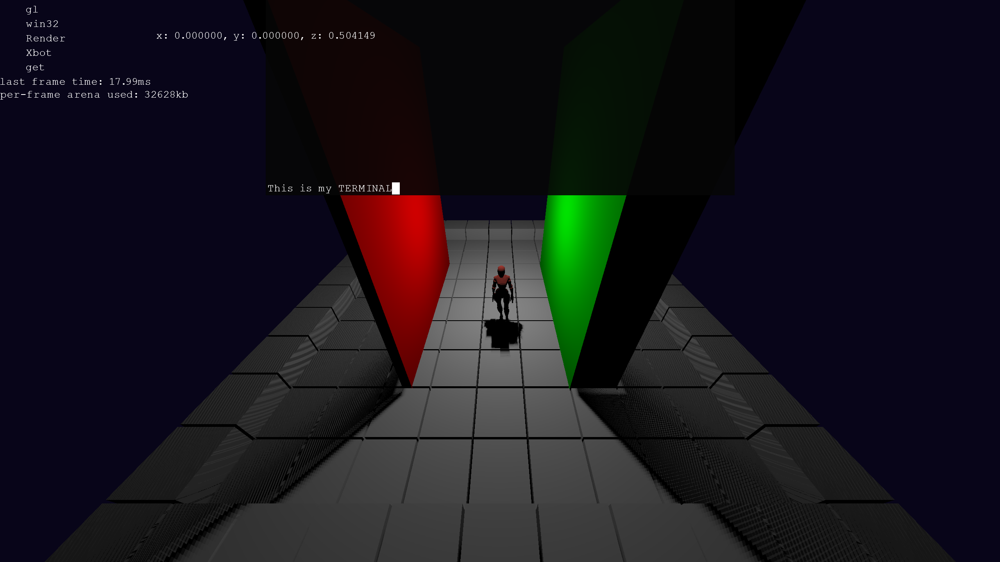
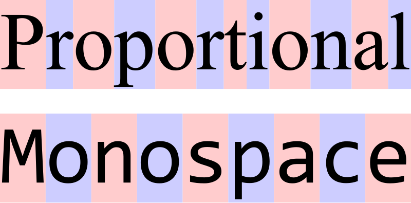

It's year 2024 and Windows terminal sucks.  
You see a screenshot of ***Battlefield*** game below?

Rendering a real-time multiplayer game with explosions everywhere in 60fps is possible in today's computer.  
Is it too much wishing for a nice, simple ***cmd***?  
Why not build your own terminal? Then, you should know how to render a font. 
I want my own game engine! I also want a terminal in my game engine! I should definitely learn how to render a font. Where to start?  

> Terminal in my Pioneer Game Engine.


# Character Set Encoding
***ASCII*** is limited to 128 characters, with an extended version reaching 256 glyphs, making it inadequate for languages with rich character sets, such as Chinese. 
For example, the Chinese character for meat (肉) has no representation in ASCII. Even in a basic situation, you need at least 3000 symbols in Chinese lettering!
To overcome the limitation, ***Unicode*** was developed, allowing for the encoding of a vast array of characters from multiple languages. 
Within the Unicode framework, ***UTF-8*** and ***UTF-16*** are two prevalent encoding schemes. 
***UTF-8***, in particular, is a variable-length encoding that uses one to four bytes for each character, enabling it to efficiently represent the full range of Unicode characters while remaining backward compatible with ASCII. 

# Basic Typography
Character 'g' has a descender, while 'h' has an ascender. How does character glyph
relate to the basline? What is the maximum descender height? What is the 
maximum ascender height?


> Comparison image from Wikipedia.

1. ***Mono or Mono-Spaced***  
Used widely in old-school terminal or typewriter.
Spaces are consistent and often, looks quite dumb.


2. ***Proportional***  
Still, Constant spacing for each letter can be a problem. For example, it seems reasonable to set the space between "ij" closer than "gj". 
The point being, the distance between letters heavily depend on the "pair" of letters.


***Kerning*** typically refers to the delta between the normal spacing and
pair spacing.

e.g.  
| A | B | Kerning |  
| g | j | -5 |  

# Font Rendering
You can think of several options rendering a font.  
1. Load TTF → Turn in to triangles (Tessellation) and get outlined-version of it.  
There's a caveat in it. For example, for 'S', you have to pick some degree of fidelity of curves.

2. Load TTF → Implicit Rasterization, which means, determine if each pixel is in a shape or not.  
  It works in any resolution and perfectly smooth curve is guaranteed. But for 99.9999% of time, it's an overkill, 
  since most games know their target resolution and font size.

3. Prerasterized Fonts ❤️  
  Build bitmaps that capture the font at certain resolution (e.g., 1920x1080).
  We will simply blt from the bitmap. No matter how complicated the glyph is,
  there's no big change in performance. If you are in US, you don't have to worry about license for
  this method. Other methods are technically software. There was a ruling that
  says font files are instructions to computer on how to generate font in any
  resolution, that is copywritable as "software". Font is still not copywritable.
  If you were to trace your own outline, that is legal. Resulting font shape is
  not copywritable. It's just an image.  

Font may be colored in fly. It can be monochrome which is 8-bit value, how much
coverage was.  

# Finally,
To sum it up, we need:  
    ```Captured Font + Code Points + Rect Positioning Info + Kerning Table```


[stb_truetype](https://github.com/nothings/stb/tree/master) by Sean Barrett is a great choice for a font rendering library.
It is a simple, easy-to-use single-header file that is widely used.
It is sensibly designed and integrates very cleanly.  
Also, every operating system supports extracting font data. So if you are willing to go down this path, good luck!
