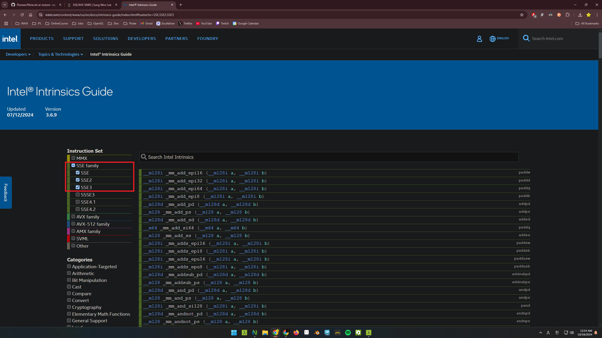

New to CPU SIMD programming? First, [this page](https://www.intel.com/content/www/us/en/docs/intrinsics-guide/index.html) is a must.  
Woah, don't be scared.

We'll mostly use those in the red rectangle, SSE. But why? Let's look at the ***Steam hardware survery*** down below.

> Steam hardware survey  
> -2024 October

Every user got SSE in their CPU!  
If you get a reasonable speed on SSE, you don't necessarily need AVX programming, even though it is powerful. You can achieve greater compatability.  
Wait, what's SIMD? What's SSE and AVX?

# SIMD and SSE/AVX
***SIMD*** stands for 'Single Instruction, Multiple Data'. It sounds fast, isn't it?  
Remember, we are programming CPU SIMD here, not GPU.
