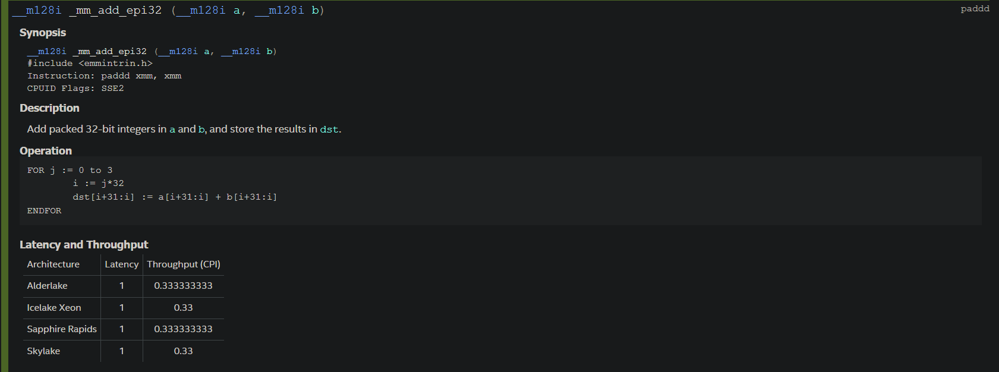
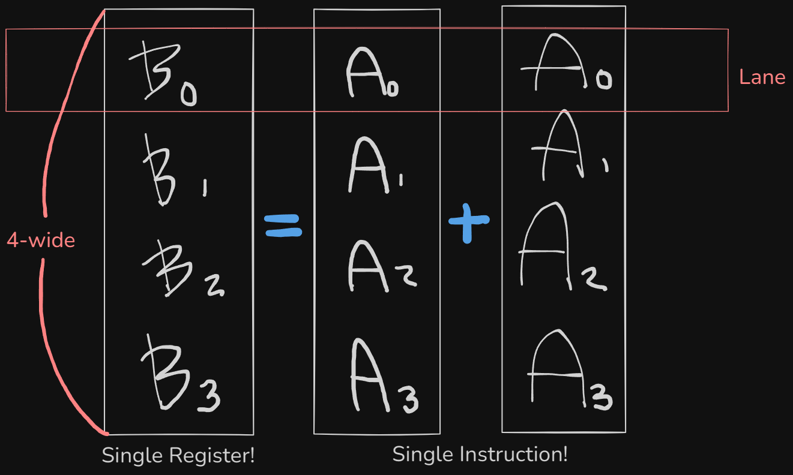
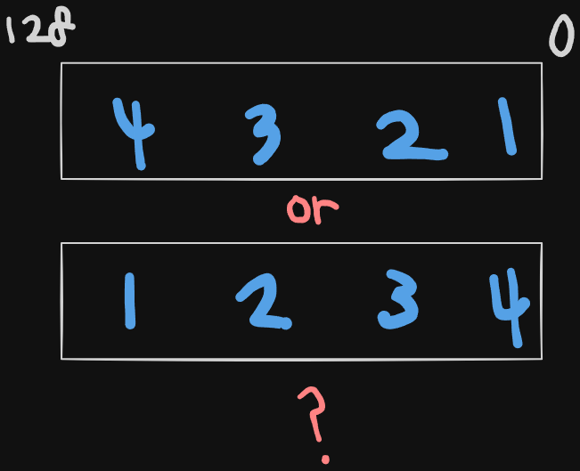
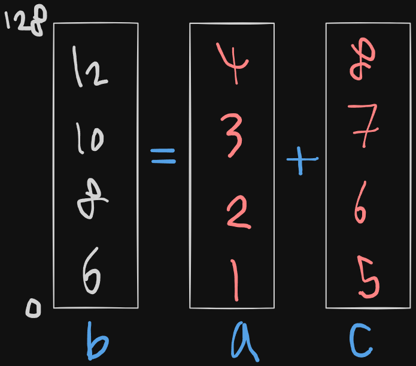
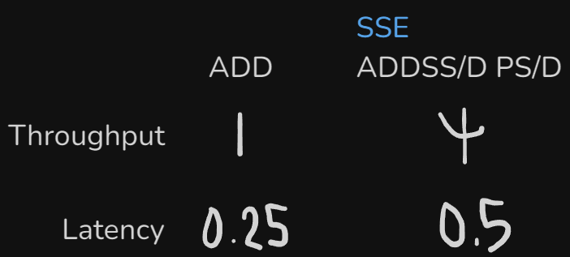
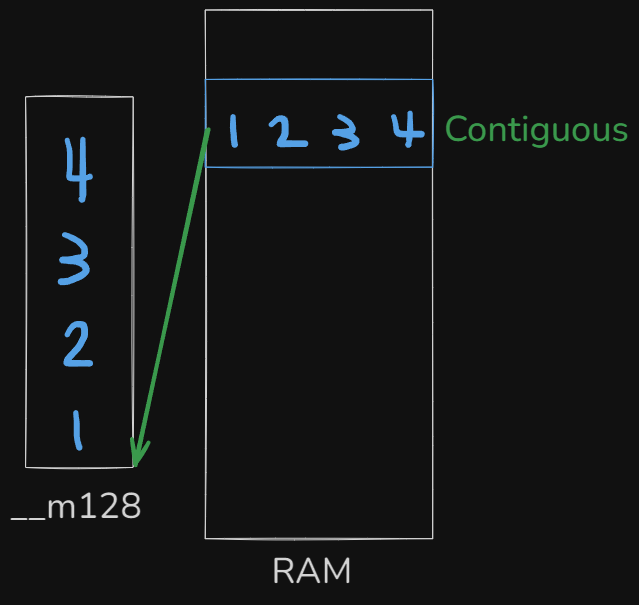
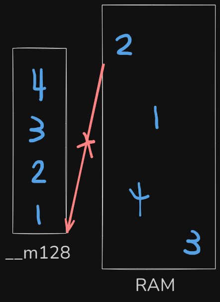
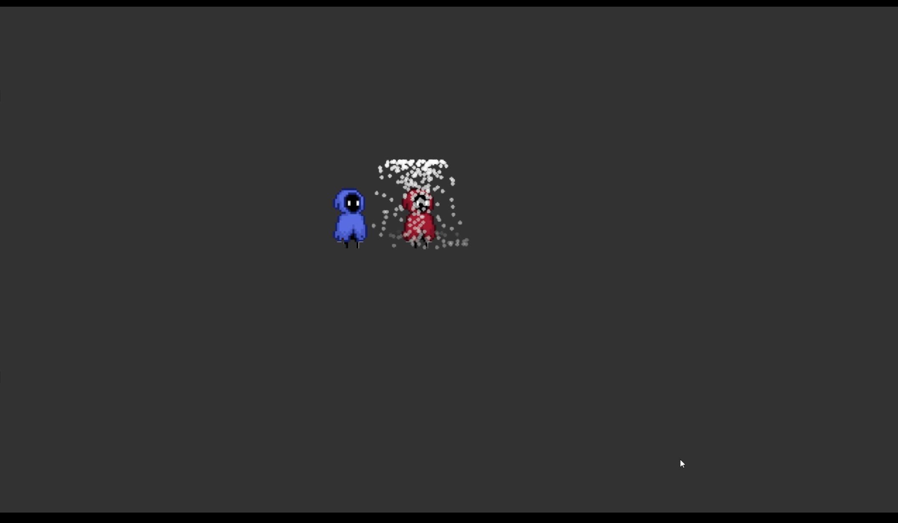

New to CPU SIMD programming? First, [this page](https://www.intel.com/content/www/us/en/docs/intrinsics-guide/index.html) is a must.  
Woah, don't be scared.

We'll mostly use those in the red rectangle, the SSE series. But why? Let's look at the ***Steam hardware survery*** down below.


> Steam hardware survey  
> -2024 October

Every user got SSE in their CPU!  
If you get a reasonable performance on SSE, you don't necessarily need AVX programming, even though it is powerful. You can achieve greater compatability.  
Wait, what's SIMD? What's SSE and AVX?

# SSE
***SIMD*** stands for 'Single Instruction, Multiple Data'. It sounds fast, doesn't it?  
Let's clik on the ***_mm_add_epi32*** on the Intel doc.

> Those Intel guys who wrote this documentation are amazing. 

So, what's happening in this instruction? For starters, you'll only recognize the word ***add***.


Yes, indeed, it is an ***add*** instruction.  
Registers in SSE are 4-wide. What does it mean? It could accomodate four 32-bit values. So, the capacity would be 128-bit. 
Surprise! I thought all registers were 64-bit wide in x64!  
But what's different from 
```
int b0 = a0 + c0;
int b1 = a1 + c1;
int b2 = a2 + c2;
int b3 = a3 + c3;
```
this?  
Well, first, let's look what would the code look like if I use SSE in C/C++.

```
#include <intrin.h>

...

__m128i a = _mm_set_epi32(4, 3, 2, 1);
__m128i c = _mm_set_epi32(8, 7, 6, 5);

__m128i b = _mm_add_epi32(a, c);
```
> The name of header file depends on the platform, architecture, compiler you are using.  
> The code above works on Windows MSVC x64.

Looks intimidating? Let me break it down for you.  
- ***__m128i***  
Just hoist out '__m'. Then what's left is '128i'. Guess what? It's 128-bit wide and the compiler will interpret as an integer! 
Then a, b, c above must be 4-wide integer variables!  
- ***_mm_set_epi32()***  
'pi32' means, 'packed integer 32-bit'. It simply returns 4-wide __m128i value you pass as a parameter.
But, there's a caveat. Is it
  
> Remember! You can always look it up on the Intel doc.  

4 goes to the highest in the register. Luckily, there's a reversed version of it too. ***_mm_setr_epi32()***.  

- ***_mm_add_epi32()***  
Now you know what would happen if you run the code above.
  

Great! You might have guessed SSE's faster than adding 4 times just like a normal person would do. Unless, there would be absolutely no reason to 
bother using it. But how fast is it?  
On ***Intel Skylake***,
  
> Of course, uops, ports availability, cache... there's a lot more to consider.

You just unlocked a cheat code for performance! But why not use it everywhere in your codebase?


# Limitations
AKSSUALLY... you can google it. I'll just share a few things I've learned the hard way.  
1. ***Loading***  
First,  
  
this is possible. You can load contiguous 4-wide values from your RAM with a single instruction.  
However,  
  
you can't load arbitrarily located values to a SSE register with a single instruction.
2. ***Conditonal Statement***  
You have to use ***mask*** for ***if*** statements. Values in a SSE register are like, brothers in arms. They must move together, and 
it was the most frustrating part in SIMD programming.

# My Usage
In early stage of my game engine, I didn't use hardware graphcis API. It was rendered purely with CPU.
> Of course, the data must have reached GPU to draw on my monitor, but you get the idea.

As the number of bitmaps to be rendered increased, a powerful weapon was urgently needed to solve the performance problem. 
Combining ***Multi-Threading*** and ***SSE SIMD***, the performance skyrocketed. Playing 2D games without GPU seemed possible on today's CPU.

  
> Early stage of my Pioneer Game Engine.


For those who are interested in my code, I'll leave it down below.
```

internal void
draw_bitmap_fast(Bitmap *buffer, v2 origin, v2 axisX, v2 axisY, Bitmap *bmp, v4 color)
{
    s32 bufWidthMax = buffer->width - 1;
    s32 bufHeightMax = buffer->height - 1;

    s32 minX = bufWidthMax;
    s32 maxX = 0;
    s32 minY = bufHeightMax;
    s32 maxY = 0;

    v2 Vs[4] = {
        origin,
        origin + axisX,
        origin + axisY,
        origin + axisX + axisY
    };

    for (s32 idx = 0;
            idx < array_count(Vs);
            ++idx) {
        v2 V = Vs[idx];
        s32 floorX = FloorR32ToS32(V.x);
        s32 floorY = FloorR32ToS32(V.y);
        s32 ceilX = CeilR32ToS32(V.x);
        s32 ceilY = CeilR32ToS32(V.y);
        if (floorX < minX) { minX = floorX; }
        if (floorY < minY) { minY = floorY; }
        if (ceilX > maxX)  { maxX = ceilX; }
        if (ceilY > maxY)  { maxY = ceilY; }
    }

    if (minX < 0) { minX = 0; }
    if (minY < 0) { minY = 0; }
    if (maxX > bufWidthMax) { maxX = bufWidthMax; }
    if (maxY > bufHeightMax) { maxY = bufHeightMax; }


#define M(m, i)  ((f32 *)&m)[i]
#define Mi(m, i) ((u32 *)&m)[i]
#define _mm_clamp01_ps(A) _mm_max_ps(_mm_min_ps(A, Onef), Zerof)
#define _mm_square_ps(A) _mm_mul_ps(A, A)
#define mmLerp(A, B, T)  _mm_add_ps(_mm_mul_ps(T, B), _mm_mul_ps(_mm_sub_ps(Onef, T), A))

    __m128 Zerof = _mm_set1_ps(0.0f);
    __m128 Onef = _mm_set1_ps(1.0f);
    __m128 point_5 = _mm_set1_ps(0.5f);
    __m128i MaskFF = _mm_set1_epi32(0xFF);
    __m128 m255f = _mm_set1_ps(255.0f);
    __m128 inv255f = _mm_set1_ps(1.0f / 255.0f);
    __m128 tint_r = _mm_clamp01_ps(_mm_set1_ps(color.r));
    __m128 tint_g = _mm_clamp01_ps(_mm_set1_ps(color.g));
    __m128 tint_b = _mm_clamp01_ps(_mm_set1_ps(color.b));
    __m128 alphaf = _mm_clamp01_ps(_mm_set1_ps(color.a));

    __m128 Ox = _mm_set1_ps(origin.x);
    __m128 Oy = _mm_set1_ps(origin.y);
    __m128 axisXx = _mm_set1_ps(axisX.x);
    __m128 axisXy = _mm_set1_ps(axisX.y);
    __m128 axisYx = _mm_set1_ps(axisY.x);
    __m128 axisYy = _mm_set1_ps(axisY.y);

    __m128 bmpWidthMinusTwo = _mm_set1_ps((f32)(bmp->width - 2));
    __m128 bmpHeightMinusTwo = _mm_set1_ps((f32)(bmp->height - 2));

    __m128 InvLenSquareX = _mm_set1_ps(InvLenSquare(axisX));
    __m128 InvLenSquareY = _mm_set1_ps(InvLenSquare(axisY));


    {
        for (s32 Y = minY;
                Y <= maxY;
                ++Y) {

            __m128i Yi = _mm_set1_epi32(Y);
            __m128 Yf = _mm_cvtepi32_ps(Yi);
            __m128 Py = _mm_sub_ps(Yf, Oy);

            for (s32 X = minX;
                    X <= maxX;
                    X += 4) {

                // NOTE: Clamp X
                if (X + 3 > maxX) { X = maxX - 3; }
                if (X < 0) { X = 0; }

                __m128i Xi = _mm_setr_epi32(X, X + 1, X + 2, X + 3);
                __m128 Xf = _mm_cvtepi32_ps(Xi);
                __m128 Px = _mm_sub_ps(Xf, Ox);

                // NOTE: We'll just clamp U and V to guarantee that
                // we fetch from valid memory. Then, whatever the value is,
                // we'll knock out useless ones with write mask.
                __m128 Uf = _mm_clamp01_ps(_mm_mul_ps(_mm_add_ps(_mm_mul_ps(Px, axisXx), _mm_mul_ps(Py, axisXy)), InvLenSquareX));
                __m128 Vf = _mm_clamp01_ps(_mm_mul_ps(_mm_add_ps(_mm_mul_ps(Px, axisYx), _mm_mul_ps(Py, axisYy)), InvLenSquareY));

                // NOTE: Write Mask from inner product.
                __m128i WriteMask = _mm_castps_si128(_mm_and_ps(
                            _mm_and_ps( _mm_cmpge_ps(Uf, Zerof), _mm_cmple_ps(Uf, Onef) ),
                            _mm_and_ps( _mm_cmpge_ps(Vf, Zerof), _mm_cmple_ps(Vf, Onef) )));

                Uf = _mm_mul_ps(Uf, bmpWidthMinusTwo);
                Vf = _mm_mul_ps(Vf, bmpHeightMinusTwo);


                //
                // Bilinear Filtering
                //
                __m128 SA, SR, SG, SB;
#if 1
                // NOTE: Floor and get weight.
                __m128i Ui = _mm_cvttps_epi32(Uf);
                __m128i Vi = _mm_cvttps_epi32(Vf);
                __m128 Rx = _mm_sub_ps(Uf, _mm_cvtepi32_ps(Ui));
                __m128 Ry = _mm_sub_ps(Vf, _mm_cvtepi32_ps(Vi));

                // NOTE: Fetch 4 texels for each pixel.
                // Sadly, there's no such things as SIMD fetch.
                // So the loop will stay.

                __m128i texel0 = _mm_set1_epi32(0);
                __m128i texel1 = _mm_set1_epi32(0);
                __m128i texel2 = _mm_set1_epi32(0);
                __m128i texel3 = _mm_set1_epi32(0);

                for (int I = 0;
                        I < 4;
                        ++I) {
                    s32 movY = (Mi(Vi, I) * bmp->pitch);
                    s32 movX = (Mi(Ui, I) * sizeof(u32));

                    u8 *txl0 = (u8 *)bmp->memory + movY + movX;
                    u8 *txl1 = txl0 + sizeof(u32);
                    u8 *txl2 = txl0 + bmp->pitch;
                    u8 *txl3 = txl2 + sizeof(u32);

                    Mi(texel0, I) = *(u32 *)txl0;
                    Mi(texel1, I) = *(u32 *)txl1;
                    Mi(texel2, I) = *(u32 *)txl2;
                    Mi(texel3, I) = *(u32 *)txl3;
                }

                // NOTE: Square to move out from sRGB.
                __m128 A0 =  _mm_mul_ps(_mm_cvtepi32_ps(_mm_and_si128(_mm_srli_epi32(texel0, 24), MaskFF)), inv255f); // 0-1
                __m128 R0 =  _mm_mul_ps(_mm_square_ps(_mm_cvtepi32_ps(_mm_and_si128(_mm_srli_epi32(texel0, 16), MaskFF))), inv255f); // 0-255
                __m128 G0 =  _mm_mul_ps(_mm_square_ps(_mm_cvtepi32_ps(_mm_and_si128(_mm_srli_epi32(texel0,  8), MaskFF))), inv255f); // 0-255
                __m128 B0 =  _mm_mul_ps(_mm_square_ps(_mm_cvtepi32_ps(_mm_and_si128(_mm_srli_epi32(texel0,  0), MaskFF))), inv255f); // 0-255

                __m128 A1 =  _mm_mul_ps(_mm_cvtepi32_ps(_mm_and_si128(_mm_srli_epi32(texel1, 24), MaskFF)), inv255f); // 0-1
                __m128 R1 =  _mm_mul_ps(_mm_square_ps(_mm_cvtepi32_ps(_mm_and_si128(_mm_srli_epi32(texel1, 16), MaskFF))), inv255f); // 0-255
                __m128 G1 =  _mm_mul_ps(_mm_square_ps(_mm_cvtepi32_ps(_mm_and_si128(_mm_srli_epi32(texel1,  8), MaskFF))), inv255f); // 0-255
                __m128 B1 =  _mm_mul_ps(_mm_square_ps(_mm_cvtepi32_ps(_mm_and_si128(_mm_srli_epi32(texel1,  0), MaskFF))), inv255f); // 0-255

                __m128 A2 =  _mm_mul_ps(_mm_cvtepi32_ps(_mm_and_si128(_mm_srli_epi32(texel2, 24), MaskFF)), inv255f); // 0-1
                __m128 R2 =  _mm_mul_ps(_mm_square_ps(_mm_cvtepi32_ps(_mm_and_si128(_mm_srli_epi32(texel2, 16), MaskFF))), inv255f); // 0-255
                __m128 G2 =  _mm_mul_ps(_mm_square_ps(_mm_cvtepi32_ps(_mm_and_si128(_mm_srli_epi32(texel2,  8), MaskFF))), inv255f); // 0-255
                __m128 B2 =  _mm_mul_ps(_mm_square_ps(_mm_cvtepi32_ps(_mm_and_si128(_mm_srli_epi32(texel2,  0), MaskFF))), inv255f); // 0-255

                __m128 A3 =  _mm_mul_ps(_mm_cvtepi32_ps(_mm_and_si128(_mm_srli_epi32(texel3, 24), MaskFF)), inv255f); // 0-1
                __m128 R3 =  _mm_mul_ps(_mm_square_ps(_mm_cvtepi32_ps(_mm_and_si128(_mm_srli_epi32(texel3, 16), MaskFF))), inv255f); // 0-255
                __m128 G3 =  _mm_mul_ps(_mm_square_ps(_mm_cvtepi32_ps(_mm_and_si128(_mm_srli_epi32(texel3,  8), MaskFF))), inv255f); // 0-255
                __m128 B3 =  _mm_mul_ps(_mm_square_ps(_mm_cvtepi32_ps(_mm_and_si128(_mm_srli_epi32(texel3,  0), MaskFF))), inv255f); // 0-255

                // NOTE: Bilinear filtering and premultiply alpha.
                SA = _mm_mul_ps(mmLerp(mmLerp(A0, A1, Rx), mmLerp(A2, A3, Rx), Ry), alphaf); // 0-1
                SR = _mm_mul_ps(mmLerp(mmLerp(R0, R1, Rx), mmLerp(R2, R3, Rx), Ry), SA); // 0-255
                SG = _mm_mul_ps(mmLerp(mmLerp(G0, G1, Rx), mmLerp(G2, G3, Rx), Ry), SA); // 0-255
                SB = _mm_mul_ps(mmLerp(mmLerp(B0, B1, Rx), mmLerp(B2, B3, Rx), Ry), SA); // 0-255
#else
                // Round to nearest pixel
                __m128i Ui = _mm_cvtps_epi32(Uf);
                __m128i Vi = _mm_cvtps_epi32(Vf);

                __m128i texel = _mm_set1_epi32(0);

                for (int I = 0;
                        I < 4;
                        ++I) {
                    s32 movY = (Mi(Vi, I) * bmp->pitch);
                    s32 movX = (Mi(Ui, I) * sizeof(u32));

                    u8 *txl = (u8 *)bmp->memory + movY + movX;
                    Mi(texel, I) = *(u32 *)txl;
                }

                // Square out from sRGB area
                SA =  _mm_mul_ps(_mm_cvtepi32_ps(_mm_and_si128(_mm_srli_epi32(texel, 24), MaskFF)), inv255f); // 0-1
                SR =  _mm_mul_ps(_mm_square_ps(_mm_cvtepi32_ps(_mm_and_si128(_mm_srli_epi32(texel, 16), MaskFF))), inv255f); // 0-255
                SG =  _mm_mul_ps(_mm_square_ps(_mm_cvtepi32_ps(_mm_and_si128(_mm_srli_epi32(texel,  8), MaskFF))), inv255f); // 0-255
                SB =  _mm_mul_ps(_mm_square_ps(_mm_cvtepi32_ps(_mm_and_si128(_mm_srli_epi32(texel,  0), MaskFF))), inv255f); // 0-255

                // Premultiply Alpha
                SR = _mm_mul_ps(SR, SA); // 0-255
                SG = _mm_mul_ps(SG, SA); // 0-255
                SB = _mm_mul_ps(SB, SA); // 0-255
#endif

                // tint.
                SR = _mm_mul_ps(SR, tint_r); // 0-255
                SG = _mm_mul_ps(SG, tint_g); // 0-255
                SB = _mm_mul_ps(SB, tint_b); // 0-255

                // NOTE: Fetch what was before in the background buffer.
                // Square out from sRGB and premultiply alpha.
                u32 *dst = (u32 *)buffer->memory + Y * buffer->width + X;
                __m128i D =  _mm_loadu_si128((__m128i *)dst);
                __m128 DA =  _mm_mul_ps(_mm_cvtepi32_ps(_mm_and_si128(_mm_srli_epi32(D, 24), MaskFF)), inv255f); // 0-1
                __m128 DR =  _mm_mul_ps(_mm_mul_ps(_mm_square_ps(_mm_cvtepi32_ps(_mm_and_si128(_mm_srli_epi32(D, 16), MaskFF))), inv255f), DA); // 0-255
                __m128 DG =  _mm_mul_ps(_mm_mul_ps(_mm_square_ps(_mm_cvtepi32_ps(_mm_and_si128(_mm_srli_epi32(D,  8), MaskFF))), inv255f), DA); // 0-255
                __m128 DB =  _mm_mul_ps(_mm_mul_ps(_mm_square_ps(_mm_cvtepi32_ps(_mm_and_si128(_mm_srli_epi32(D,  0), MaskFF))), inv255f), DA); // 0-255

                // NOTE: Get FINAL pixel values.
                // SquareRoot to sRGB.
                __m128i FR =_mm_cvttps_epi32(_mm_sqrt_ps(_mm_mul_ps(_mm_add_ps(SR, _mm_mul_ps(DR, _mm_sub_ps(Onef, SA))), m255f))); // 0-255
                __m128i FG =_mm_cvttps_epi32(_mm_sqrt_ps(_mm_mul_ps(_mm_add_ps(SG, _mm_mul_ps(DG, _mm_sub_ps(Onef, SA))), m255f))); // 0-255
                __m128i FB =_mm_cvttps_epi32(_mm_sqrt_ps(_mm_mul_ps(_mm_add_ps(SB, _mm_mul_ps(DB, _mm_sub_ps(Onef, SA))), m255f))); // 0-255
                __m128i FA =_mm_cvttps_epi32(_mm_mul_ps(_mm_add_ps(SA, _mm_mul_ps(DA, _mm_sub_ps(Onef, SA))), m255f));              // 0-255

                __m128i F =  _mm_or_si128(
                        _mm_or_si128(_mm_slli_epi32(FA, 24), _mm_slli_epi32(FR, 16)), 
                        _mm_or_si128(_mm_slli_epi32(FG,  8), _mm_slli_epi32(FB,  0)) );

                // NOTE: Write to buffer.
                _mm_storeu_si128((__m128i *)dst, _mm_and_si128(F, WriteMask));
            }
        }
    }

}
```

# Furthermore
Casey Muratori's [Handemade Hero Day 115](https://guide.handmadehero.org/code/day115/#112) is a great starting point for CPU SIMD programming.  
Strongly recommend watching it!
