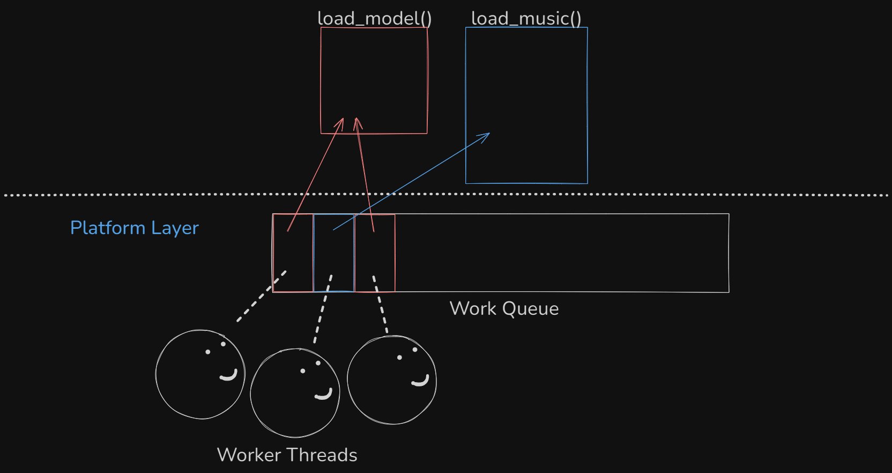
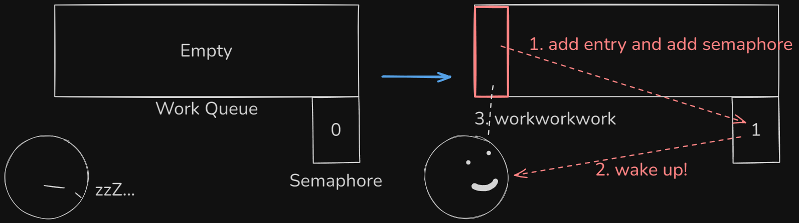
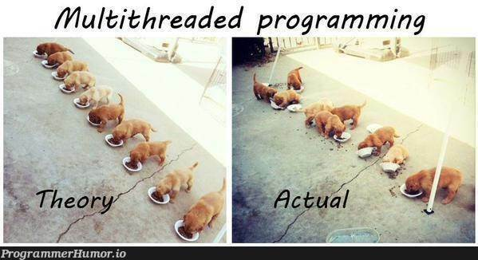

### Warning!  
This isn't a "Introduction to Multithreading 101" post.  
Instead, I'd like to introduce a specific technique used in my game engine, one that I hope will add a powerful tool to your programming arsenal.

# Work Queue
```
struct Platform_Work_Queue_Entry 
{
    Platform_Work_Queue_Callback *callback; // actual work which is a function that threads will execute.
    void *data;                             // function parameter data to pass.
};

struct Platform_Work_Queue 
{
    volatile u32 completion_goal;
    volatile u32 completion_count;

    volatile u32 next_entry_to_write;
    volatile u32 next_entry_to_read;
    HANDLE semaphore_handle;

    Work_Queue_Entry entries[256];
};
```
Basically, worker threads will pick up the work in the queue if it isn't empty. Also, I don't want my main thread to 
pick up the work. I just want it to proceed the game. 
The ***callback function*** should have a function prototype as below.  
```void Name(Platform_Work_Queue *queue, void *data)```  
For example, it would be something like this.
```
static void
load_model(Platform_Work_Queue *queue, void *data)
{
    // Thread will load model from your hard-drive!
}
```

> Drawing of worker threads peaking the queue. Actually, it is a circular queue in my code.

How many threads should I make then? Thread is actually nothing more than a state. 
So you can go nuts and make thousands of them. But if you consider yourself a reasonable person, you should first know how many cores your CPU got.

```
#include <windows.h>

static u32
get_cpu_core_count(void)
{
    SYSTEM_INFO info;
    GetSystemInfo(&info);
    u32 result = info.dwNumberOfProcessors;
    return result;
}
```
> C/C++ code querying core count on Windows.

I just simply queried Windows info structure and extracted the core count from it.  
Thread process goes like the code below.
```
DWORD WINAPI
thread_proc(LPVOID lpParameter) 
{
    Platform_Work_Queue *queue = (Platform_Work_Queue *)lpParameter;

    for(;;) 
    {
        if (win32_do_next_work_queue_entry(queue)) 
        {
            WaitForSingleObjectEx(queue->semaphore_handle, INFINITE, FALSE);
        }
    }
}
```

> Drawing of how semaphore works here.

Nice, we saved some on the electric bill. Wait, you haven’t heard of semaphore?  
Forgive me—I'll give a quick overview.  
Semaphore is a software concept used for synchronization, implemented using hardware-supported atomic instructions (e.g., CMPXCHG—Compare and Exchange—on x86).  
Great. Now what would the code that adds a work to the queue be like?  

```
static void
win32_add_entry(Platform_Work_Queue *queue, Platform_Work_Queue_Callback *callback, void *data) 
{
    u32 new_next_entry_to_write = (queue->next_entry_to_write + 1) % array_count(queue->entries);
    Platform_Work_Queue_Entry *entry = queue->entries + queue->next_entry_to_write;
    entry->callback = callback;
    entry->data = data;
    ++queue->completion_goal;
    _WriteBarrier();
    queue->next_entry_to_write = new_next_entry_to_write;
    ReleaseSemaphore(Queue->SemaphoreHandle, 1, 0); // in windows.h
}
```
The function above will be executed only be a ***main thread***.  
Since the queue is circular, we need mod with the queue length.  
***_WriteBarrier()*** ensures that the compiler does not reorder write operations across the barrier during optimization.  
In [here](https://learn.microsoft.com/en-us/cpp/intrinsics/writebarrier?view=msvc-170), it says the function's deprecated, but I think it works just fine.  
Then update the index and release a semaphore, which increments the semaphore atomically by 1.  

Finally,  

```
static b32
win32_do_next_work_queue_entry(Platform_Work_Queue *queue) 
{
    b32 should_sleep = false;

    u32 original_next_entry_to_read = queue->next_entry_to_read;
    u32 new_next_entry_to_read = (original_next_entry_to_read + 1) % array_count(queue->entries);
    if (original_next_entry_to_read != queue->next_entry_to_write)
    {
        u32 index = InterlockedCompareExchange((LONG volatile *)&queue->next_entry_to_read,
                                               new_next_entry_to_read,
                                               original_next_entry_to_read);
        if (index == original_next_entry_to_read)
        {        
            Platform_Work_Queue_Entry entry = queue->entries[index];
            entry.callback(queue, entry.data);
            InterlockedIncrement((LONG volatile *)&queue->completion_count);
        }
    } 
    else 
    {
        should_sleep = true;
    }

    return should_sleep;
}
```



> Multithreading requires delicacy and precision, making it one of the most challenging tasks in my experience.
