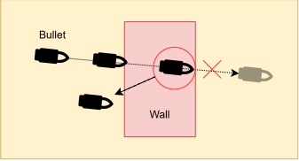
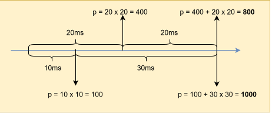
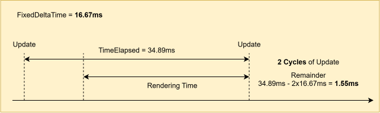
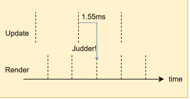
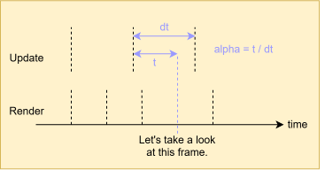
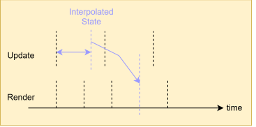
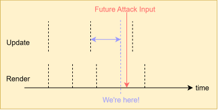
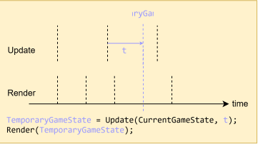
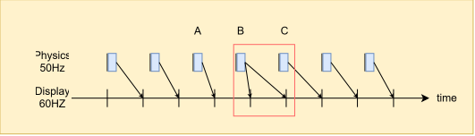

## Timestep

Why you want your tick procedure to be framerate-independent and how to implement 
it are explained wonderfully in [these links](#links), so let me skip the 
implementation details :)

### Fixed Timestep

You wan to fix the simulation timestep, at least for physics. For example, a 
bullet might penetrate a wall if the time since last update spikes for whatever
reason while using a variable timestep.

By taking as many fixed steps to cover the elapsed time, collision is detected.

Still, the bullet will penetrate a paper-thin wall, but let's not tackle this 
*tunneling* problem, at least for now, because *determinism* is a more important 
reason to fix the timestep. You want things to be consistent.

If the function for position is $p_1 = p_0 + \Delta t^2$, and the first run 
of your game has two timesteps of 10ms and 30ms, while the second run has two 
timesteps of 20ms, the result differs:

Let's say the time elapsed since the last update is $34.89ms$ and the fixed 
timestep is $16.67ms$, which means your game's tick rate it effectively $60Hz$. 
So, your update procedure will run for $2$ times. But, what do we do about the 
remainder, which is $1.55ms$?

You don't wan to run one more tick at $1.55ms$ if you've listened to me. Instead, 
carry the remainder over to the next frame by adding it to some kind of global 
accumulator.

But what do we about the rendering? If we simply ignore the remainder until the 
next frame, as the rendered frame won't reflect the actual elapsed time, there'll be 
a judder. 

### Interpolation

Interpolation comes to rescue! When it's time to render, let's interpolate 
between the two states. First, we need to compute $\alpha$, which is a blend 
weight between $\mathrm{[}0,1\mathrm{]}$.

Then, we interpolate between the current state and the previous state and 
render the interpolated state, like this:

Wait, why are we interpolating between the current state and the previous state? 
That sounds laggy. Shouldn't we interpolate between the current state and the 
next state instead, like this:

If we do that, something bad can happen. 

For example, let's say a rock is flying toward you, which is lethal. You press 
the attack button to destroy it, but the input arrives slightly after we have 
already started rendering. If we compute the next state without taking future 
inputs into account and interpolate between the two states to present the frame, 
it might look like your character is already dead. Then, on the next frame, the 
attack input is processed, and your character suddenly comes back to life. 

The problem with interpolation just on goes. Suppose you nuke some entities 
between the current and previous game states, wiping out of existence. How are 
you supposed to interpolate their transforms?

At the same time, an interpolated game state between two valid states isn't 
guaranteed to be valid itself, as illustrated below:

Say those players press *Q* and teleport, as depicted in State1 and State2. Yet
we're linearly interpolating between the two states for rendering. Two players
didn't collide, but it sure looks like they did! 

### One Last Tick

Yeah, things get gnarly pretty quickly. As it turns out, you can ditch 
interpolation altogether if you want. You just tick one more time. 

But, we can compute a temporary game state using the remainder $t$ as the 
timestep. This state is transient and used solely for rendering; it is discarded 
afterward. It's not a "real" game state.

Then, when the time comes, the "real" new game state is computed by advancing the 
previous game state by our fixed timestep, not the temporary game state.

But as you can imagine, if your game is physics or simulation-heavy, this 
approach might be not feasible for you.

### Unity Physics

As of 2026, Unity's default physics timestep is still 50Hz, which is a rather
odd choice of number, and physics aren't interpolated by default. As
illustrated below, the mismatch between physics and rendering update can cause
noticeable jank on a 60Hz monitor. A stable 50 FPS can feel better than 120 FPS
with stuttering.

So I would say tweak your default physics timestep to 60Hz or some other sane
value. You could even consider [this
option](https://docs.unity3d.com/ScriptReference/Rigidbody-interpolation.html).
But, as you now know, it interpolates between the previous and current states, 
so your character might feel one frame behind other objects.

## Summary

I'd like to borrow a line from [Phillip Trudeau](https://philliptrudeau.com/)
here, since I think he put it quite well. 

>**Naive display** isn't smooth.  
**Interpolation** isn't recent.  
**Extrapolation** isn't honest.  

And one more from me: **Extra tick** isn't free. That said, if your tick goes
brrrr at 240Hz, naive display is probably fine.

## Links

[Glenn Fiedler. "Fix Your Timestep!"](https://www.gafferongames.com/post/fix_your_timestep/)  
[Jonathan Blow. "Q&A: frame-rate-independence"](https://www.youtube.com/watch?v=fdAOPHgW7qM)  
[Jakub Tomšů. "Fixed timestep without interpolation"](https://jakubtomsu.github.io/posts/fixed_timestep_without_interpolation/)  
[Taha Torabpour. "Upgrade Your Timestep"](https://lotusspring.substack.com/p/upgrade-your-timestep)  
[Tyler Glaiel. "How to make your game run at 60fps"](https://medium.com/@tglaiel/how-to-make-your-game-run-at-60fps-24c61210fe75)  
