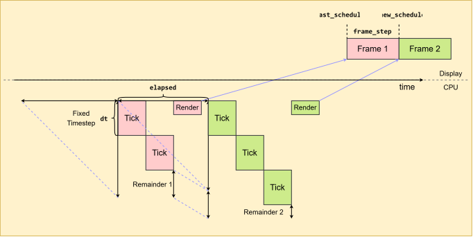

# 프레임 페이싱

> 게임의 로직 및 렌더링 루프를 운영체제의 디스플레이 서브시스템과
> 그 아래의 실제 디스플레이 하드웨어에 동기화하는 것.

## 부드러움은 CPU만으로 결정되지 않는다

지난번에는 고정된 시뮬레이션 타임스텝을 사용해 전체 `deltaTime`을 처리하고, 렌더링과 시뮬레이션을 분리한 뒤, 보간(interpolation), 외삽(extrapolation), 추가 틱(render tick) 등 상황에 적합한 기법을 사용하기로 했다.

그런데 과연 우리가 계산한 `deltaTime`은 정말 **올바른 값**일까?

2018년, *Serious Sam*과 *The Talos Principle*을 만든 *Croteam*은 GDC에서 프레임 스터터링을 둘러싼 기묘한 현상에 관한 발표를 했다.

[발표 영상](https://www.gdcvault.com/play/1025031/Advanced-Graphics-Techniques-Tutorial-The)

분명 어딘가에서 성능 저하가 발생해서 프레임 하나가 프레젠테이션 데드라인을 놓친 것이라고 생각할 수 있다. 그렇다면 이런 상황을 예상할 것이다:


그런데 **기묘한 부분**은, 실제로 같은 프레임이 두 번 표시된 적이 없다는 것이다. 심지어 어떤 프레임은 예상보다 "더 빠르게" 표시되기도 했다.

개인적으로도 이 현상을 이해하는 데 꽤 애를 먹었다. 그래서 나 같은 초보자를 위해 하나씩 살펴보자. 우선 아주 간단한 게임 루프가 있다고 하자.

```Pseudocode
while running {
    time_new   = now();
    delta_time = time_new - time_old;
    time_old   = time_new;

    state = update(delta_time);
    render(state);
}
```

운영체제 스케줄러가 우울했다고 해보자. 그 결과 `DeltaTime`이 24.8ms로
측정되었다. 괜찮다. 캐릭터를 24.8ms만큼 이동시키면 된다. 그러면 움직임도
자연스럽게 유지할 수 있다. `DeltaTime`을 `Update`에 반영해보자.


그런 다음 GPU가 버퍼를 렌더링하고, 디스플레이가 이를 스캔아웃한다.


그리고 우리가 실제로 보는 것은 다음과 같다.


여기서부터 불일치가 발생한다. 우리가 마지막으로 본 프레임은 무엇일까? 바로 이 파란색 프레임이다.


모니터가 60Hz로 동작한다고 하자. 그렇다면 새로운 프레임을 보는 시점 사이의 간격은 16.67ms이다.


우리 뇌는 초록색 프레임의 캐릭터가 이전 프레임 이후 16.67ms 동안 이동했다고
예상한다. 하지만 게임은 실제로 캐릭터를 24.8ms만큼 이동시켰다. **게임은
프레임이 정확히 언제 디스플레이에 표시되는지 모르기 때문이다.**


잠깐, 프레임 사이의 간격은 그냥 일정한 16.67ms 아닌가? 그렇다면 매 프레임
`DeltaTime`을 계산하는 대신 그냥 16.67ms를 넣으면 되는 것 아닌가? 천재적인
생각이다! 그런데 문제가 하나 있다.

## 현대적인 파이프라인

좋아. 이제 *현대의 비동기-병렬-파이프라인으로 이루어진 복잡한 구조*를
마주해보자.


무섭긴 하다. 일단 하나의 프레임이 어떤 과정을 거치는지에만 집중해보자.


CPU가 GPU에 작업을 제출하고 `Present()`를 호출하면 프레젠테이션이 큐에
들어간다. 그리고 VSync 시점이 되어 해당 프레젠테이션이 큐에서 빠져나올 때, GPU
작업이 완료되어 있다면 스캔아웃이 시작되고 프레임이 디스플레이에 표시된다.

그런데 우리가 앞에서 보고 있던 것은 이 부분이다.


연속된 `Update()` 호출 사이의 시간은 24.8ms로 측정되었다. 디스플레이의 주사율과
맞지 않기 때문에 떨림이 발생한다. 여기서 우리의 질문은 다음과 같았다.

> 그렇다면 60Hz 모니터에서는 그냥 16.67ms로 고정하면 되는 것 아닌가?

도움은 된다. 하지만 이것만으로는 부드러움 문제를 완전히 해결할 수 없다.

여전히 프레임이 실제로 언제 화면에 나타날지, 그리고 얼마나 오랫동안 화면에 남아 있을지를 정확히 알 수 없기 때문이다. 그것도 이런 현대의 두껍고 복잡한 파이프라인에서는 말이다.


캐릭터는 16.67ms만큼 이동했지만, 그 프레임이 실제로 화면에 표시될 때는 이미 33.33ms가 지나갔다.

그리고 이런 일이 계속 발생한다고 생각해보자.

우리는 매 프레임 16.67ms가 지났다고 가정하고 렌더링하지만, 실제로 우리가 보는 모든 프레임은 이미 33.33ms만큼 오래된 프레임이다.

좋지 않다.

현재 우리가 알고 있는 것은 디스플레이의 주사율뿐이다. 여기에 추가로 필요한 것은 다음 두 가지다.

1. 과거 프레임에 대한 정보를 조회할 수 있어야 한다.
2. 미래의 프레임이 언제 표시될지 예약할 수 있어야 한다.

이 두 가지가 있다면, 이를 이용해 디스플레이 주기에 맞춰 화면을 부드럽게 만들기 위한 자신만의 휴리스틱을 구성할 수 있다.

대략적인 아이디어는 이렇다.

목표 주사율을 60Hz로 설정했다고 하자. 만약 하나의 프레임이 예정된 시점을 놓쳤다면, 그 프레임이 실제로 화면에 표시된 시간에 맞춰 목표 주사율을 낮춘다.

예를 들어 60Hz 모니터에서 하나의 프레임이 두 번의 VSync 구간에 걸쳐 표시되었다면, 주사율을 30Hz로 낮추는 것이다.

그런 다음 연속된 $N$개의 프레임이 일정한 여유 시간만큼 더 일찍 표시될 수 있었다면, 다시 주사율을 점진적으로 높인다.

*Vulkan*에는 바로 이러한 기능을 제공하기 위한 `VK_GOOGLE_display_timing` 확장이 있다.

안타깝게도 어떤 이유에서인지 [일부 플랫폼](https://vulkan.gpuinfo.org/displayextensiondetail.php?extension=VK_GOOGLE_display_timing)에만 지원되는 것으로 보인다. 그리고 *Direct3D*에는 프레임을 예약할 방법이 없다.

*Croteam*의 발표가 나온 지 벌써 8년이 지났다는 점까지 생각하면, 상황이 여전히 썩 좋지는 않다.

## 게임 루프 업데이트

모든 것을 우리가 사용할 수 있다고 가정해보자. 앞에서 이야기한 고정 타임스텝과 "렌더 틱(render tick)"을 결합한다면, 새로운 게임 루프는 어떤 모습이 될까?

아마 다음과 비슷할 것이다.

```Pseudocode
while running {
    elapsed_time := compute_elapsed_time();
    accumulator  += elapsed_time;

    process_input();

    // 고정된 타임스텝 dt로 반복한다.
    while accumulator >= dt {
        // 0번과 1번 인덱스를 핑퐁한다.
        game_state[(i + 1) % 2] = tick(game_state[i], dt);
        i = (i + 1) % 2;

        accumulator -= dt;
    }

    // 휴리스틱을 사용해 'framestep'과 'new_schedule'을 계산한다.
    query_frame_infos(pending_frames, frame_history);
    new_schedule := frame_timing_heuristics(pending_frames, frame_history);
    frame_step   := new_schedule - last_schedule;

    // 'game_state[2]'는 렌더링 전용으로 예약되어 있다.
    new_render_state_timestamp := game_state[2].timestamp + frame_step;

    // 얼마나 더 틱해야 하는가?
    render_tick_dt := new_render_state_timestamp - game_state[i].timestamp;

    // 상태를 틱하고, 프레임을 렌더링하고, 디스플레이 표시를 예약한다.
    if render_tick_dt >= 0.0 {
        game_state[2] = tick(game_state[i], render_tick_dt);

        render_frame(game_state[2], new_schedule);

        frame_id := schedule_display(new_schedule);
        queue_add(pending_frames, frame_id);
        last_schedule = new_schedule;
    }
}
```



이제 더 이상 남은 시간을 이용해 "렌더 틱"을 수행하지 않는다.

물론 아직 전부 이론적인 이야기일 뿐이다. 그러니 이제 실제로 프로토타입을
만들어서 얼마나 잘 동작하는지 확인해봐야겠다.

그런데 *Direct3D*로는 어디까지 할 수 있을지는 모르겠다.

## 감사

[Blat Blatnik](https://blog.bearcats.nl/). 인내심을 가지고 질문에 답해주고,
좋은 자료를 공유해주고, 글을 리뷰해주신 것에 감사드립니다.

## 링크

[Alen Ladavac. "The Elusive Frame Timing"](https://medium.com/@alen.ladavac/the-elusive-frame-timing-168f899aec92)  
[Croteam. "The Elusive Frame Timing". GDC 2018](https://www.gdcvault.com/play/1025031/Advanced-Graphics-Techniques-Tutorial-The)  
[Croteam. "Myths and Misconceptions of Frame Pacing". Reboot Devlop Blue 2019](https://www.youtube.com/watch?v=_zpS1p0_L_o)  
[Intel. "Sample Application for Direct3D 12 Flip Model Swap Chains"](https://www.intel.com/content/www/us/en/developer/articles/code-sample/sample-application-for-direct3d-12-flip-model-swap-chains.html)  
[Android. "Frame Pacing Library"](https://developer.android.com/games/sdk/frame-pacing)  
[Unity. "Fixing Time.deltaTime in Unity 2020.2 for smoother gameplay: What did it take?"](https://unity.com/blog/engine-platform/fixing-time-deltatime-in-unity-2020-2-for-smoother-gameplay)  
