> Working on it.

# Frame Pacing

> Frame pacing is the synchronization of a game’s logic and rendering loop 
with an OS’s display subsystem and the underlying display hardware - Android

## Smoothness Isn't in the Eye of Your Game

We decoupled our simulation from rendering and fixed its timestep last time. 
But is your rendering delta time "correct"?

Back in 2018, *Croteam* (creators of *Serious Sam* and *The Talos Principle*) 
gave a [talk](https://www.gdcvault.com/play/1025031/Advanced-Graphics-Techniques-Tutorial-The) 
at GDC about a strange phenomenon surrounding frame stuttering. 

Surely there must have been a performance hitch somewhere, and the frame 
simply missed its presentation deadline, right? We'd expect to see something 
like this:

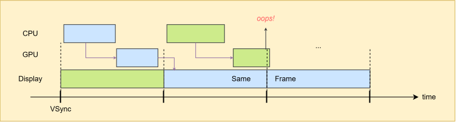

But here's the **elusive** part: no frame was ever shown twice. In fact, some 
frames were actually "faster" than expected.

Let's break it down. Here's a simple game loop:

```C
float TimeOld = Now();
while (GameRunning) {
    float TimeNew = Now();
    float DeltaTime = TimeNew - TimeOld;
    TimeOld = TimeNew;

    State = Update(DeltaTime);
    Render(State);
}
```

Suppose there's a hitch, and `DeltaTime` comes out to 24.8ms. That's fine. We 
can simply move the character forward by 24.8ms to keep the motion feeling 
natural. Let's integrate `DeltaTime` into `Update`:

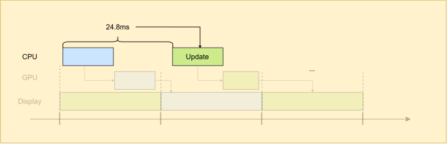

Then the GPU renders to the buffer, and the display scans it out.

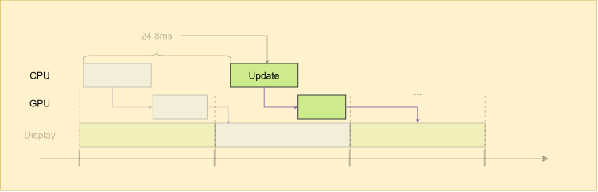

So this is what wee see:

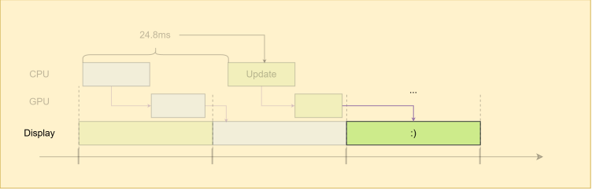

Here's where the mismatch happens. What was the last frame we saw? This blue 
one:

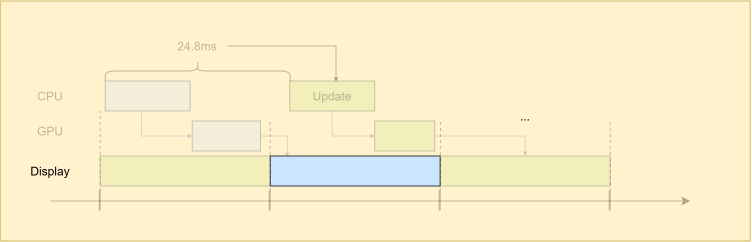

Given that the monitor runs at 60Hz, the interval between the times you see new 
frames is 16.67ms.

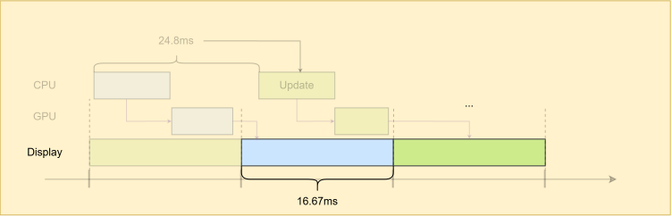

Your brain expects the character in the green frame to have moved for 16.67ms 
since the previous one. But the game actually moved it by 24.8ms, because **it 
had no idea when the previous frame was displayed and when the current frame 
will be displayed**.

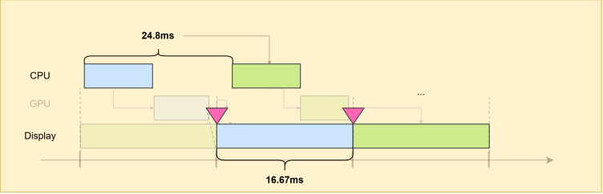

Wait, isn't the interval just a constant 16.67ms? Why don't we just plug that 
in instead of computing `DeltaTime` every frame?


## Asynchrony and Middleman

### Old Days

In good old days, things were fixed. Graphics hardware was either thin or 
nonexistent, and there were no pipelines. Things were synchronous, and there 
was no middleman between your game and the display. The game simply wrote into 
the buffer, which was then presented to you immediately. So, you could just 
plug in 16.67ms, or whatever the display's refresh interval happened to be. 

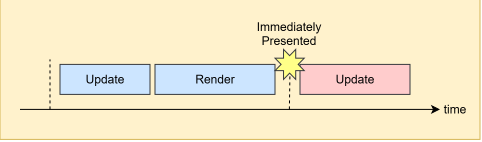

### GPU

Here comes every gamer's favorite hardware: GPU.

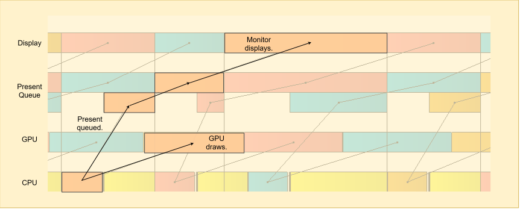

This was what we were seeing before, and my question is still unanswered: why
not use fixed 16.67ms? But, let's continue.


### Triple Buffering

Good news. your hardware just got 2x faster. Technology! 

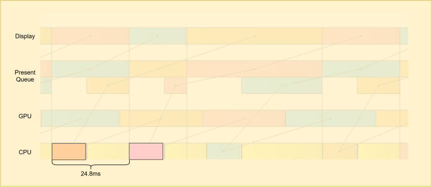

Time to talk about input latency. How long does it take for my mouse input to
be reflected in a frame and shown on my monitor? it depends on where your mouse
it on your screen, as the display scans the buffer line by line, but it would
be something like this:

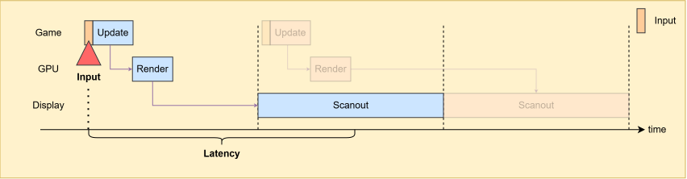

As we have extra computing power and more leeway, can't we make use of it? What
if we run one more cycle, like this:

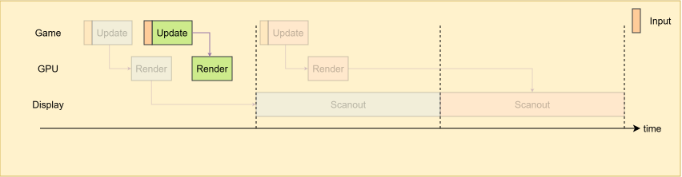

As it incorporates more hot inputs, if we present it instead, the input latency
would improve:

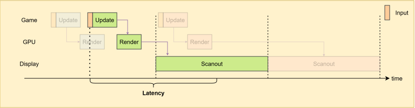

What we're doing here is called, *triple buffering*:

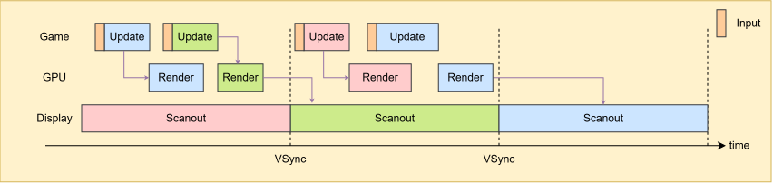

During the first VSync interval, the green and blue buffers are *back buffers*, 
while the red buffer is the *front buffer*. During this interval, while the 
GPU renders into the back buffers, the display scans out the front buffer line 
by line, allowing you to see it. 

Beginning of the second interval, the buffers are "flipped". Since the blue 
buffer contains an older frame than the green buffer, the green buffer now 
becomes the front buffer, which again, scanned out by the display.

> This is what Windows DXGI flip discard mode is. It queues "flips" and discards 
old ones.


### Somehow Fixed Timestep Returned

Remember the fixed timestep thing we talked about last time? Where does it fit
into this scheme?

Well, I would say the nuance slightly shifts. Now, we're not triple buffering
solely because of input latency. We're doing it simply because it's time to
tick, and we want to render the result. After all, what kind of game is it if
the state we just ticked isn't presented?

For example, say now we're using fixed timestep and the tick rate is twice the
display refresh rate, and we only have two buffers. As illustrated below, we
only get the spare blue workbench. If we miss the VSync deadline, we have to
display the previous red frame, and the user will feel the stutter, even though
the number says we're generating nearly twice as many frames. 

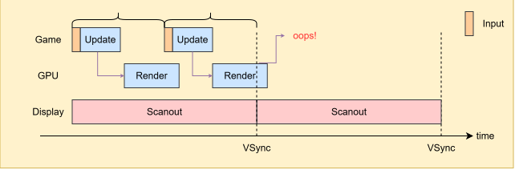

If we can somehow predict the rendering time, detect that a frame will miss its 
deadline, and decide not to render it, we won't show the latest state of the 
game, but at least we won't show the same previous frame, 

> @Todo: I think graphics API blocks the thread from acquiring the same buffer 
after present() is queued, depending on the setup.

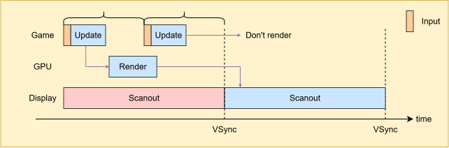

This was our first glimpse of **frame pacing**. We controlled the pace of frame 
generation for the sake of the user. Now you see why FPS isn't the golden rule, 
and why being fast isn't enough.

Instead, we can add an additional workbench. Then we no longer have to rely on 
statistical voodoo or pray that the system remains stable. With a backup in 
place, we're "safe" even if the second rendering misses its deadline.

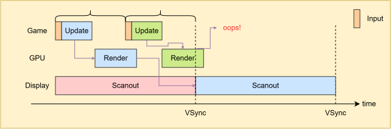

In this scheme, whose primary focus is deterministic simulation with a fixed 
timestep, I would say improved latency is more of a byproduct.

> Input latency is a whole another rabbithole, IMO. There's even tech like
[NVIDIA Reflex](https://developer.nvidia.com/performance-rendering-tools/reflex), 
which shifts the image just in time to incorporate the latest input and then
fills the hole. But anyway, I digress.

Hey, we were talking about whether using a fixed 16.67ms for rendering is 
feasible.


## Links

[Croteam. "The Elusive Frame Timing". GDC 2018](https://www.gdcvault.com/play/1025031/Advanced-Graphics-Techniques-Tutorial-The)  
[Unity. "Fixing Time.deltaTime in Unity 2020.2 for smoother gameplay: What did it take?."](https://unity.com/blog/engine-platform/fixing-time-deltatime-in-unity-2020-2-for-smoother-gameplay)  
[Android. "Frame Pacing Libary"](https://developer.android.com/games/sdk/frame-pacing)  
[Raph Levien. "Swapchains and frame pacing"](https://raphlinus.github.io/ui/graphics/gpu/2021/10/22/swapchain-frame-pacing.html)  
[Intel. Sample Application for Direct3D 12 Flip Model Swap Chains](https://www.intel.com/content/www/us/en/developer/articles/code-sample/sample-application-for-direct3d-12-flip-model-swap-chains.html)
[James Darpinian. "Techniques to Reduce Latency in Your Apps"](https://james.darpinian.com/blog/latency-techniques/)  
[NVIDIA Reflex](https://developer.nvidia.com/performance-rendering-tools/reflex)  
