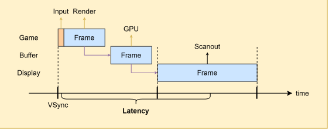
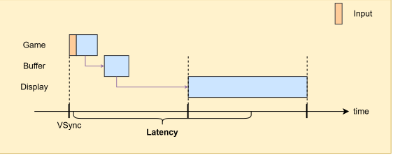
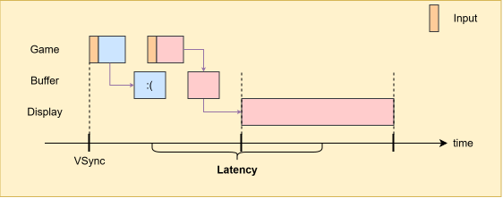
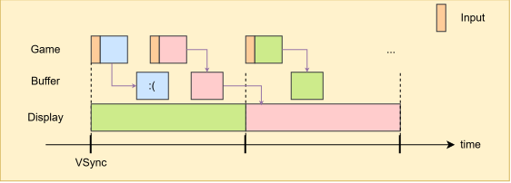
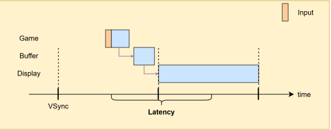
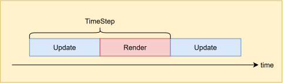
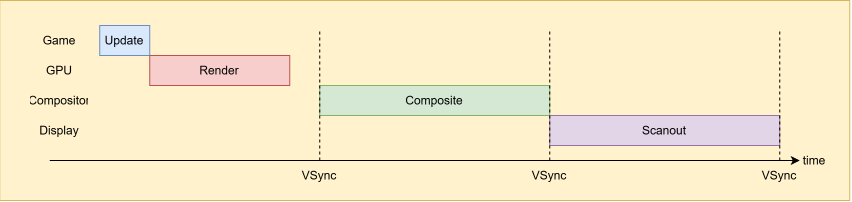
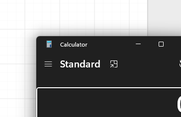

# Working on it.

## Frame Pacing

### Leeway, aka Slop

How long does it take for my mouse input to be reflected in a frame and shown 
on my monitor? In other words, what's the latency? It looks something like this:

Good news! Our hardware got faster, and we now have 2x performance improvement! 
Surely, the input latency has improved, right? Actually, it hasn't. We have 
more leeway, but it turns out that it's just slop. 

### Triple Buffering

Let's dial up our simulation rate, advance one more tick, then render that state. 
Because the later frame incorporates more recent input, it reflects lower latency. 
Now we have two frames, but since we always draw the newest one, the older frame 
is discarded outright. 
 

What's going on is *triple buffering*:

Three buffers are colored red, blue, and green. During the first VSync interval, 
the red and blue buffers are *back buffers*, while the green buffer is the 
*front buffer*. During this interval, while you render into back buffers, your 
monitor scans out the front buffer line by line, allowing you to see it. 

At the second VSync, the buffers are "flipped". Since the blue buffer contains 
an older frame than the red buffer, the red buffer becomes the new front buffer. 
The monitor scans it out again, while the GPU renders the next frame into the 
green buffer, which was the front buffer just before.

> This is what Windows DXGI flip discard mode is. It queues "flips" and discards 
old ones.

## Acknowledgements

[Croteam. "The Elusive Frame Timing". GDC 2018](https://www.gdcvault.com/play/1025031/Advanced-Graphics-Techniques-Tutorial-The)  
[Unity. "Fixing Time.deltaTime in Unity 2020.2 for smoother gameplay: What did it take?."](https://unity.com/blog/engine-platform/fixing-time-deltatime-in-unity-2020-2-for-smoother-gameplay)  
[Android. "Frame Pacing Libary"](https://developer.android.com/games/sdk/frame-pacing)  
[James Darpinian. "Techniques to Reduce Latency in Your Apps"](https://james.darpinian.com/blog/latency-techniques/)  
[Raph Levien. "Swapchains and frame pacing"](https://raphlinus.github.io/ui/graphics/gpu/2021/10/22/swapchain-frame-pacing.html)  
[Intel. Sample Application for Direct3D 12 Flip Model Swap Chains](https://www.intel.com/content/www/us/en/developer/articles/code-sample/sample-application-for-direct3d-12-flip-model-swap-chains.html)

# Temporary

We can do some statistical voodoo and somehow predict how long rendering 
will take, then defer rendering and complete just before VSync. That'll give us 
the best latency without wasting resources.

In good old days, things were fixed, graphics hardware was either thin or 
nonexistent, and there were no pipelines. Everything was synchronous. There 
was no middleman between the CPU and the display.

Enter the modern era: everything is pipelined. First, let's take a look at 
how a particular frame generally makes its way to the screen:

Game ticks on the CPU and submits draw commands to the GPU through driver. 
Then, the GPU gets gets to work and renders to the app's render target. We 
aren't halfway through it yet. Let's say your monitor is running at 60Hz. Then, 
for 16.67ms, operating system's compositor composites all the windows on your 
screen. Who doesn't love liquid glass and shadow effects? Finally, at VSync, 
the composited frame is presented to the monitor, which scans it out line by 
line.

In Windows, there's something called *exclusive fullscreen mode*. This mode 
allows your app to  bypass the compositor. If your app is in fullscreen, there's 
nothing else to composite, right? So the timeline becomes something like this:

> Compositor, swap chain and flip modes are yet another rabbit hole, 
and we'll get into them later.
