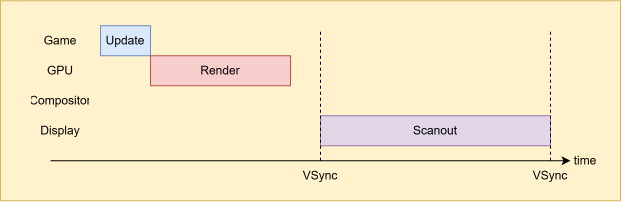

> I thought the thumbnail was pretty appropriate, as the topic is quite a deep 
rabbit hole, IMO, and it is "a matter of time."

## Timestep

Why you want your tick procedure to be framerate-independent and how to implement 
it are explained wonderfully in [these posts](#acknowledgements). so I'll be brief 
about the timestep part.

### Fixed Timestep

You want your timestep to be fixed. If your timestep is simply the amount of time 
elapsed since the last update, bad things can happen. For example, a bullet might 
penetrate a wall if rendering takes too long. Instead of integrating one large, 
variable timestep like this:

By taking as many fixed steps to cover the elapsed time, collisions will be 
detected, and the bullet won't pass through the wall, like this:

Still, the bullet will go through a super-thin wall, but it at least mitigates 
the problem, Let's not tackle this *tunneling* problem, at least for now. 
But, the real juice of fixed timestep is *determinism*. You want things to be 
consistent.

If the function for position is $p_1 = p_0 + \Delta t^2$, and the first run 
of your game has two timesteps of 1ms and 3ms, while the second run has two 
timesteps of 2ms, the result differs:

Let's say the time elapsed since the last update is $34.89ms$ and the fixed 
timestep is $16.67ms$, which means your game's tick rate it effectively $60Hz$. 
So, your update procedure will run for $2$ times. But, what do we do about the 
remainder, which is $1.55ms$?

You don't wan to run one more tick at $1.55ms$ if you've listened to me. Instead, 
carry the remainder over to the next frame by adding it to some kind of global 
accumulator.

But what do we about the rendering? If we simply ignore the remainder until the 
next frame, as the rendered frame won't reflect the actual elapsed time, there'll be 
a judder. 

### Interpolation

Interpolation comes to rescue! When it comes to rendering, let's interpolate 
between the two states. First, we need to compute $\alpha$, which is a blend 
weight between $\mathrm{[}0,1\mathrm{]}$.

Then, we interpolate between the current state and the previous state and 
render the interpolated state, like this:

Wait, why are we interpolating between the current state and the previous state? 
That sounds laggy. Shouldn't we interpolate between the current state and the 
next state instead, like this:

Should we compute the next state and interpolate between the current and next states? 
If we do that, something bad can happen. 

For example, let's say a rock is flying toward you, which is lethal. You press 
the attack button to destroy it, but the input arrives slightly after we have 
already started rendering. If we compute the next state without taking future 
inputs into account and interpolate between the two states to present the frame, 
it might look like your character is already dead. Then, on the next frame, the 
attack input is processed, and your character suddenly comes back to life. 

The problem with interpolation just on goes. Suppose you nuke some entities 
between the current and previous game states, wiping out of existence. How are 
you supposed to interpolate their transforms?

At the same time, an interpolated game state between two valid states isn't 
guaranteed to be valid itself, as illustrated below:

Those two players' movements aren't linear, yet we are linearly interpolating 
between two states for rendering. Two players didn't actually collide, but it 
sure looks like they did! Maybe you could use some kind of velocity buffer, 
but anyway, you get the point.

### One Last Tick

Yeah, things get gnarly pretty quickly. As it turns out, you can ditch 
interpolation altogether if you want. You can simply simulate one more time. 

But, we can compute a temporary game state using the remainder $t$ as the 
timestep. This state is transient and used solely for rendering; it is discarded 
afterward. It is not an authorized or "real" game state.

Then, when the time comes, the "real" new game state is computed by advancing the 
previous game state by our fixed timestep, not the temporary game state.

But as you can imagine, if your game is physics or simulation-heavy, this 
approach might be not feasible for you. You can even extrapolate from the 
previous and current states, but rumors say nobody does that. 

### Unity

As of 2026, Unity's default physics timestep is still 50Hz, which is a rather odd 
choice of number, and game states are not globally interpolated by default. 
As illustrated below, the mismatch between physics update and rendering can 
cause noticeable jank on a 60Hz monitor. Remember, a stable 50 FPS can feel better 
than 120 FPS with stuttering.

So I would say tweak your default physics timestep to 60Hz or something reasonable. 
You could even consider [this option](https://docs.unity3d.com/ScriptReference/Rigidbody-interpolation.html). 
But, here's the catch: as described before, it interpolates between the previous 
and current states. So while other physics states will render their current 
state, a rigid body with interpolation enabled will render an interpolated state, 
effectively introducing additional tick of latency. 

### Thoughts

Certainly, it looks like there's no one-size-fits-all solution. I dunno, man. 

## Frame Pacing

In good old days, things were fixed, graphics hardware was either thin or 
nonexistent, and there were no pipelines. Everything was synchronous. There 
was no middleman between the CPU and the display.

Enter the modern era: everything is pipelined. First, let's take a look at 
how a particular frame generally makes its way to the screen:

Game ticks on the CPU and submits draw commands to the GPU through driver. 
Then, the GPU gets gets to work and renders to the app's render target. We 
aren't halfway through it yet. Let's say your monitor is running at 60Hz. Then, 
for 16.67ms, operating system's compositor composites all the windows on your 
screen. Who doesn't love liquid glass and shadow effects? Finally, at VSync, 
the composited frame is presented to the monitor, which scans it out line by 
line.

In Windows, there's something called *exclusive fullscreen mode*. This mode 
allows your app to  bypass the compositor. If your app is in fullscreen, there's 
nothing else to composite, right? So the timeline becomes something like this:

> Compositor, swap chain and flip modes are yet another rabbit hole, 
and we'll get into them later.

## Acknowledgements

### Timestep
[Glenn Fiedler. "Fix Your Timestep!"](https://www.gafferongames.com/post/fix_your_timestep/)  
[Jakub Tomšů. "Fixed timestep without interpolation"](https://jakubtomsu.github.io/posts/fixed_timestep_without_interpolation/)  
[Taha Torabpour. "Upgrade Your Timestep"](https://lotusspring.substack.com/p/upgrade-your-timestep)  
[Jonathan Blow. "Q&A: frame-rate-independence"](https://www.youtube.com/watch?v=fdAOPHgW7qM)  

### Frame Pacing
[Croteam. "The Elusive Frame Timing". GDC 2018](https://www.gdcvault.com/play/1025031/Advanced-Graphics-Techniques-Tutorial-The)  
https://james.darpinian.com/blog/latency/  
https://james.darpinian.com/blog/latency-techniques/  
https://raphlinus.github.io/ui/graphics/gpu/2021/10/22/swapchain-frame-pacing.html  
