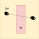
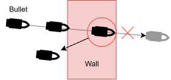
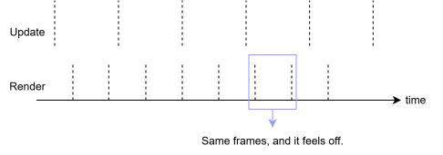
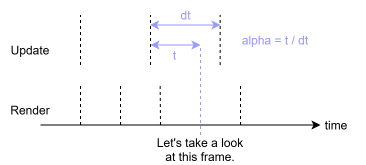
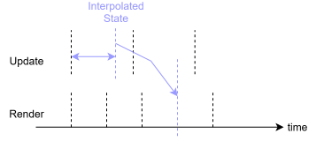
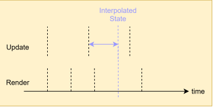
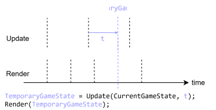
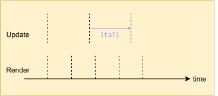

> I thought the thumbnail was pretty appropriate, as the topic is quite a deep 
rabbit hole, IMO, and it is "a matter of time."

## Timestep

Why you want your tick procedure to be framerate-independent and how to implement 
it are explained wonderfully in [these posts](#acknowledgements). so I'll be brief 
about the timestep part.

### Fixed Timestep

You want your timestep to be fixed. If your timestep is simply the amount of time 
elapsed since the last update, bad things can happen. For example, a bullet might 
penetrate a wall if rendering takes too long. Instead of integrating one large, 
variable timestep like this:

By taking as many fixed steps to cover the elapsed time, collisions will be 
detected, and the bullet won't pass through the wall, like this:

Let's say the time elapsed since the last update is $34.89ms$ and the fixed 
timestep is $16.67ms$, which means your game's tick rate it effectively $60Hz$. 
So, your update procedure will run for $2$ times. But, what do we do about the 
remainder, which is $1.55ms$?

Well, we can run one more update procedure at $1.55ms$, which seems reasonable. 
But, here's the thing: if you want things to be deterministic, you don't want to 
do that, because of floating point precision—in the sense that `0.1 + 0.2 != 0.3`.

So, what you want to do is carry the remainder over to the next frame by adding 
it to some kind of global accumulator. But what do we about the rendering ? 
If we simply ignore the remainder until the next frame, as the rendered frame 
won't reflect the actual elapsed time, making the result feel off, as illustrated 
below:

### Interpolation

Interpolation comes to rescue! When it comes to rendering, we'll interpolate 
between the two states. First, we need to compute $\alpha$, which is a blend 
weight between $\mathrm{[}0,1\mathrm{]}$.

Then, we interpolate between the current state and the previous state and 
render the interpolated state, like this:

Wait, why are we interpolating between the current state and the previous state? 
That sounds laggy. Shouldn't we interpolate between the current state and the 
next state instead, like this:

Also, suppose you nuke some entities between the current and previous game 
states, wiping out of existence. How are you supposed to interpolate their 
transforms?

At the same time, an interpolated game state between two valid states isn't 
guaranteed to be valid itself, as illustrated below:

Two players didn't actually collide, but it sure looks like they did! Maybe 
you can use some kind of velocity buffer, but anyway, you get the point.

### One Last Tick

Yeah, things get gnarly pretty quickly. As it turns out, you can ditch 
interpolation altogether if you want. You can simply simulate one more time. 
Since we can't account for future inputs, we can't compute the "next" game state 
ahead of time.

But, we can compute a temporary game state using the remainder $t$ as the 
timestep. This state is transient and used solely for rendering. 

Then, when the time comes, the "real" new game state is computed by advancing the 
previous game state by our fixed timestep, not the temporary game state.

You can implement this by maintaining some kind of triple buffer for the frames.

### Unity

As of 2026, Unity's default physics timestep is still 50Hz, which is rather odd 
choice of number. As illustrated below, a 60Hz monitor will occasionally display 
the exact same frame twice, which can significantly hinder the gaming experience. 
A stable 50fps can feel better than an average 120fps with stuttering.

So I would say tweak your default physics timestep to 60Hz or something reasonable. 
You could even consider [this option](https://docs.unity3d.com/ScriptReference/Rigidbody-interpolation.html). 
But, here's the catch: as described before, it interpolates between the previous 
and current states. So while other physics states will render their current 
state, a rigid body with interpolation enabled will render an interpolated state, 
effectively introducing additional tick of latency. 

### Thoughts

At this point, I really wanted to say, *"It's all trade-offs, bro"*, but I 
dunno man.

# Frame Pacing part is currently being written.

## Acknowledgements

### Timestep
[Glenn Fiedler. "Fix Your Timestep!"](https://www.gafferongames.com/post/fix_your_timestep/)  
[Jakub Tomšů. "Fixed timestep without interpolation"](https://jakubtomsu.github.io/posts/fixed_timestep_without_interpolation/)  
[Taha Torabpour. "Upgrade Your Timestep"](https://lotusspring.substack.com/p/upgrade-your-timestep)  
[Jonathan Blow. "Q&A: frame-rate-independence"](https://www.youtube.com/watch?v=fdAOPHgW7qM)  

### Frame Pacing
https://james.darpinian.com/blog/latency/
https://james.darpinian.com/blog/latency-techniques/
https://raphlinus.github.io/ui/graphics/gpu/2021/10/22/swapchain-frame-pacing.html
