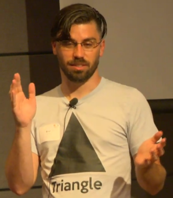
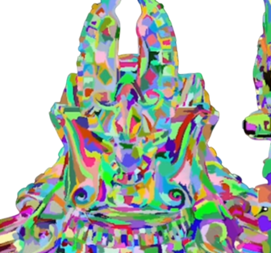
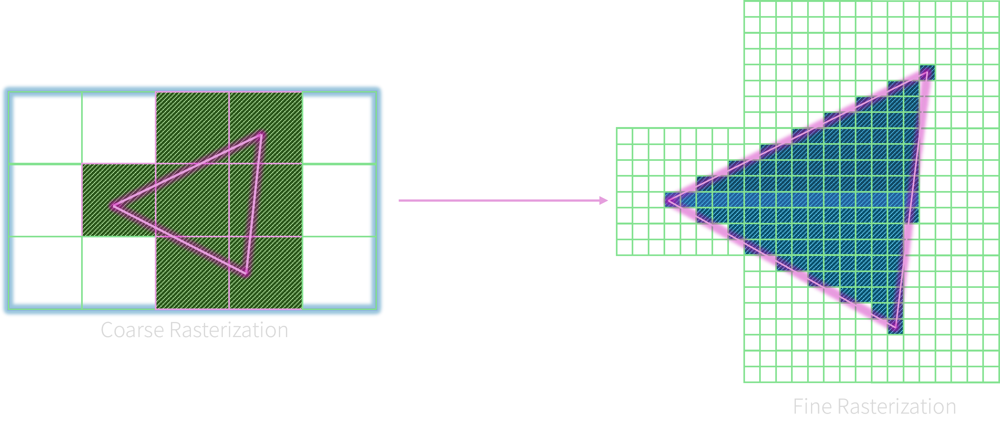
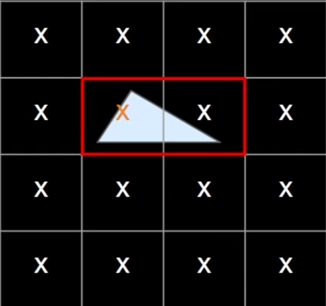
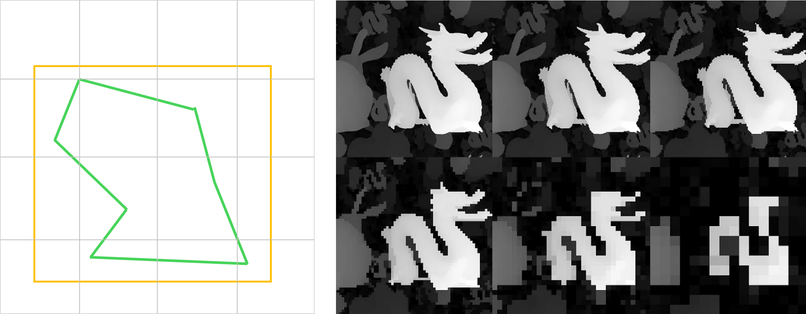
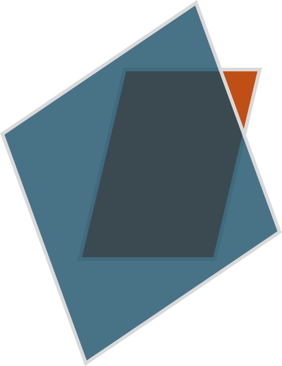

**삼각형**, 이 기본적인 도형은 썸네일을 차지할 자격이 있다.  
나나이트 개발을 이끈 Brian Karis가 [영상](https://youtu.be/NRnj_lnpORU)에서 입고 나온 옷을 보아라.




그 이유를 알아보기 전, 나나이트를 한 문장으로 정리하면, **클러스터 계층을 기반으로 한 LOD 시스템**이다.  

## 동기

Brian Karis 팀이 해결하고자 한 문제는 무엇일까? 이는 크게 다음 세 가지이다.

- 아티스트의 수고를 덜자.
- LOD 전환을 부드럽게 하자.
- 삼각형 몇 백만 개의 에셋을 쓸 수 있게 하자.

> "아티스트와 친하게 지내라." — Brian Karis


## 클러스터

메쉬를 분할할 것이다. 분할한 각 부분을 **클러스터**라고 부르고, 각 클러스터는 **128개의 삼각형**으로 이루어져있다.  
런타임 때, 멀리 있는 클러스터들을 묶어서 하나의 클러스터로 단순화한다.



기존의 렌더링 비용은 삼각형의 수에 비례한다. 즉, 씬 (scene)의 복잡도에 따라 크게 달라진다.  
마법처럼 $O(1)$의 복잡도로, 즉, 상수로 비용을 줄일 수 없을까?

**1 삼각형 ≈ 1 픽셀**. 이게 나나이트의 핵심이다.  
삼각형들이 1 픽셀보다 작아진다? 즉, 스크린에서 삼각형의 밀도가 높아진다? 이때 낮은 디테일의 부모 클러스터로 교체한다.  
씬의 복잡도에 비례하던 렌더링 비용이, 변하지 않는 픽셀 수, 즉, 상수가 되었다.  

왜 하필 1 픽셀일까? 2x2는 안 될까? 정보의 최소 단위인 1 픽셀에서 LOD 전환이 가장 부드러울 것이다.  
실제로는 전환이 눈에 띈다. 하지만 TAA를 얹는다면 부드럽다.  


## 하드웨어 래스터라이저

1 삼각형 ≈ 1 픽셀. 이는 삼각형이 매우 작다는 말이다. 그리고 **하드웨어 래스터라이저는 작은 삼각형에 약하다**.  
하드웨어 래스터라이저의 동작을 나타내면 다음과 같다:

```pseudocode
for px : pixels {
    for tri : triangles {
        test(px, tri);
    }
}
```

이중 반복문에서 픽셀이 바깥에, 삼각형이 안쪽에 있다. 그리고 픽셀과 삼각형이 겹치는지 검사를 한다고 생각하면 된다. 삼각형이 1 픽셀 크기라면 어떤 문제가 일어날까? 
1 픽셀을 위해 어마어마한 양의 픽셀을 검사해야한다. 이는 받아들일 수 없는 수율이다. 하지만 고정된 하드웨어를 고칠 수는 없는 노릇이다. 따라서 Brian Karis 팀은 컴퓨트 셰이더로 소프트웨어 래스터라이저를 작성했다.




## 소프트웨어 래스터라이저

소프트웨어 세계에서는 프로그래머에게 자유가 주어진다.  
이제는 각 삼각형을 감싸는 상자 (bounding box)를 활용해 검사할 픽셀들을 제한할 수 있다. 아래 그림을 참조하라.



스레드 그룹 (thread group) 크기 128, 컴퓨트 셰이더, 소프트웨어 래스터라이저를 직접 작성한 것이다.  
128로부터 유추해보면, 한 스레드당 클러스터의 삼각형 하나씩 맡은 것 같다.

Brian Karis가 말하기를, 돌고 돌아 삼각형이었다고 한다.  
또, 깊이 테스트는 여전히 필요하므로, 이를 `InterlockedMax`를 통해 구현한다고 한다.


## 컬링

나나이트에서의 컬링을 살펴보자.  
클러스터를 감싸는 상자 (bounding box)를 구한다. 그리고 이 상자의 크기가 4x4 픽셀보다 작아질 때까지 깊이 버퍼의 밉 체인 (mip chain)을 따라 내려간다. 
왜 4x4인가? 너무 fine하면 텍스쳐 캐시 효율이 떨어지고, 너무 coarse하면 정확성이 확보되지 않는다.



왜 나나이트가 **겹침**에 약한지 드러난다.  
기존 하드웨어 래스터라이저에서 Early-Z 컬링의 단위는 4x4 픽셀 정도이다. (하드웨어마다 상이하다.)  
나나이트에서는 컬링의 단위가, 위에서 보았듯이, 한 클러스터, 즉, 삼각형 128개이다. 이는 생각보다 크다.

아래 그림을 보자. 푸른 클러스터 뒤에 붉은 클러스터가 겹쳐져 있다. 기존 하드웨어 래스터라이저에서는 걸러질 법 하지만, 나나이트에서는 뒤의 클러스터도 
꼼짝없이 그릴 수 밖에 없다.





## 에픽의 기술력

소프트웨어 래스터라이저와 2단계 오클루전 컬링은 사실 새로운 기술이 아니다. Brian Karis 팀은 두 가지 난제를 풀었다:

1. 클러스터 빌드
2. 하드웨어 맵핑

이 두 개가 에픽의 기술이라 볼 수 있겠다.

### 클러스터 빌드

클러스터 계층을 생성할 때, 틈이 생기면 안 된다. 즉, 한 클러스터는 이웃하는 클러스터와 연계해서 계층을 만들어야한다.  
필자는 *"복셀은 uniform sampling이기 때문에 lossy하다."*, *"머그잔과 도넛은 위상학적으로 같다."*라고 할 때부터 이해하기를 포기했다.

### 하드웨어 맵핑

GPU의 메모리도 CPU처럼 **페이지**로 이루어져 있다. 따라서, 지금 안 쓰이는 LOD의 클러스터를 디스크로 스왑할 수 있다. 가변 크기의 클러스터를 
고정 크기의 페이지에 어떻게 잘 끼워넣을까가 문제들 중 하나였다고 한다.

이외에도, 즉각적인 디코딩, 양자화, 비트패킹, 위상 인코딩, LZ 압축 알고리즘을 고려한 설계 등, 엄청난 수고가 들어갔음은 분명하다.


## 결론

나나이트는 1 픽셀 삼각형에 강하다. 많이 겹치면 안 좋다.

Brian Karis 팀의 집념과 기술, 그리고 에픽의 리더십이 대단하다고 느꼈다.  
본인은 CPU 래스터라이저를 만들어본 경험이 나나이트를 이해하는 데 큰 도움이 됐다. 


## 관련 링크

[A Deep Dive into Nanite Virtualized Geometry](https://youtu.be/eviSykqSUUw)  
[HPG 2022 Keynote: The Journey to Nanite – Brian Karis, Epic Games](https://youtu.be/NRnj_lnpORU?list=LL)   
[Optimizing Geometry for the GPU | Zeux 02:13:04](https://youtu.be/KtxiuFe83Hg?t=7984)  
[Multiresolution structures for interactive visualization of very large 3D datasets](https://vcg.isti.cnr.it/~ponchio/download/ponchio_phd.pdf)  
[Nanite-like implementation in WebGPU](https://scthe.github.io/nanite-webgpu/?scene_file=jinxCombined&impostors_threshold=4000&softwarerasterizer_threshold=1360&nanite_errorthreshold=0.1)  