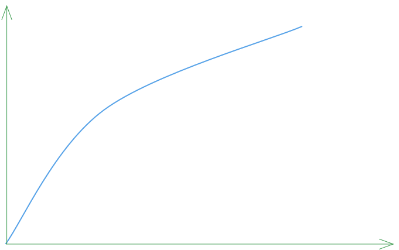
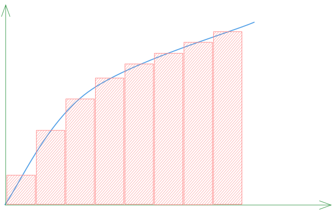
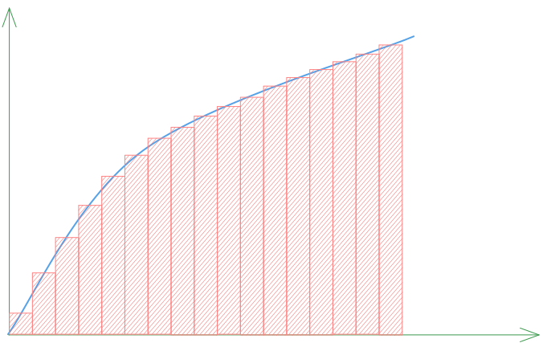

$$
L(\mathbf{x}, \boldsymbol{\omega}) = \int_0^D T(t)\,\Big[{\sigma_s(\mathbf{x}_t)\,L_{\text{scat}}(\mathbf{x}_t, \boldsymbol{\omega})}\Big]\,dt + T(D)\,L_0
$$

이번 글에는 이전에 배운 것을 가지고 위 식을 어떻게 코드로 구현할지 살펴보자.

# Ⅰ. 리만 합

적분과 컴퓨터는 잘 어울리지 않는 것 같다. 이산적인 0과 1의 기계가, 연속적인 실수의 적분과 어떻게 어울린단 말인가?

예를 들어, 위의 그래프를 적분하는 코드를 어떻게 짤 수 있을까?

> 당연히, 파이썬에서 `quad(f, 0, 1)` 따위로 날로 먹는 것을 말하는 게 아니다.

리만 합 (Riemann Sum)이라는 게 있다. 위 그림을 보자. 사각형들의 넓이의 합으로 근사하겠다는 것이다. 적분을 처음 배울 때 본 것 같지 않은가?

당연하게도, 사각형의 수가 많아질수록 정확하다. 종이 위에서 적분한 값과 오차가 적어진다는 말이다.

이 사각형들의 합은, 적분과 달리, 단순 반복문으로 구현할 수 있겠다. 그래픽스는 근사의 예술이다. 소수점 아래 100자리까지 정확할 필요가 없다. 
시각적으로 설득력이 있는 한에서 사각형의 수를 줄일 수도, 프로세서가 불타지 않는 선에서 늘릴 수도 있다. 이후 이렇게 이산적으로 쪼갤 수 있는 사각형, 표본을 샘플(sample)이라 하겠다.

# Ⅱ. 레이 마칭 (Ray Marching)