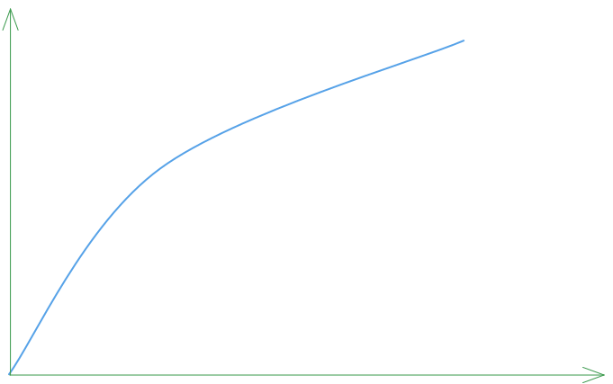
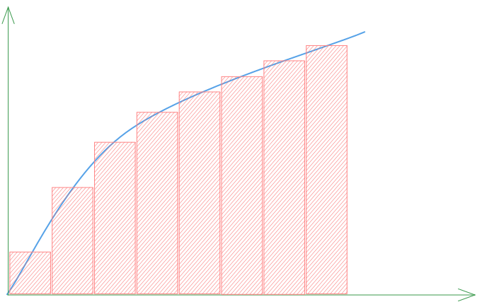
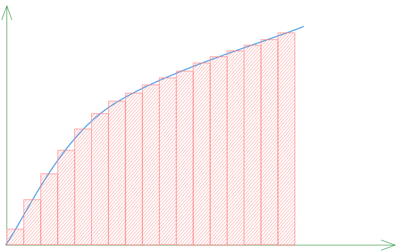

<p>
$$
L(\mathbf{x}, \boldsymbol{\omega}) = \int_0^D T(t)\,\Big[{\sigma_s(\mathbf{x}_t)\,L_{\text{scat}}(\mathbf{x}_t, \boldsymbol{\omega})}\Big]\,dt + T(D)\,L_0
$$
</p>

이번 글에는 이전에 배운 것을 가지고 위 식을 어떻게 코드로 구현할지 살펴보자.


# Ⅰ. 리만 합

적분과 컴퓨터는 잘 어울리지 않는 것 같다. 이산적인 0과 1의 기계가, 연속적인 실수의 적분과 어떻게 어울린단 말인가?



예를 들어, 위의 그래프를 적분하는 코드를 어떻게 짤 수 있을까?

> 당연히, 파이썬에서 `quad(f, 0, 1)` 따위로 날로 먹는 것을 말하는 게 아니다.




리만 합 (Riemann Sum)이라는 게 있다. 위 그림을 보자. 사각형들의 넓이의 합으로 근사하겠다는 것이다. 적분을 처음 배울 때 본 것 같지 않은가?



당연하게도, 사각형의 수가 많아질수록 정확하다. 종이 위에서 적분한 값과 오차가 적어진다는 말이다.

이 사각형들의 합은, 적분과 달리, 단순 반복문으로 구현할 수 있겠다. 그래픽스는 근사의 예술이다. 소수점 아래 100자리까지 정확할 필요가 없다. 
시각적으로 설득력이 있는 한에서 사각형의 수를 줄일 수도, 프로세서가 불타지 않는 선에서 늘릴 수도 있다. 이후 이렇게 이산적으로 쪼갤 수 있는 사각형, 표본을 샘플(sample)이라 하겠다.


# Ⅱ. 레이 마칭 (Ray Marching)

리만 합으로 적분을 근사할 수 있다는 것을 알았으니, 이제 실제로 카메라 레이를 따라 표본을 뽑아보자. 카메라에서 대기를 빠져나가는 지점까지의 거리를 $D$라 하면, 이 구간을 $N$개로 쪼개어 각 구간의 중점에서 피적분 함수를 평가하고 더하면 된다.

$$
L(\mathbf{x}, \boldsymbol{\omega}) \approx \sum_{i=0}^{N-1} \Delta t \cdot T(t_i)\,\sigma_s(\mathbf{x}_{t_i})\,L_{\text{scat}}(\mathbf{x}_{t_i}, \boldsymbol{\omega})
$$

코드로 옮기면 다음과 같다. `sigma_s`는 지난 글에서 구한 레일리·미 산란 계수와 밀도 분포를 곱한 값이다.

```hlsl
float3 L = 0;
float dt = D / N;
for (int i = 0; i < N; i++) {
    float t = (i + 0.5) * dt; // 구간의 중점에서 샘플링
    float3 x = ro + rd * t;

    float3 sigma_s = rayleigh_scattering(x) + mie_scattering(x);
    float3 L_scat = /* ... */;

    L += transmittance(ro, x) * sigma_s * L_scat * dt;
}
```

말끔해 보이지만, `transmittance(ro, x)` 안에 함정이 숨어 있다.


## 투과율 속의 또 다른 적분

$T(t)$를 다시 떠올려보자.

$$
T(t) = e^{-\int_0^t{\sigma_t(\mathbf{x}_s)}\,ds}
$$

지수 안에 또 적분이 있다. 즉, 레이를 따라 한 걸음 나아갈 때마다 그 지점의 투과율을 구하려면 원점부터 거기까지 또 한 번 리만 합을 돌려야 한다는 뜻이다. 다행히 이건 생각보다 간단히 해결된다 — 주 레이 마칭을 진행하면서, 지나온 광학 깊이(optical depth) $\tau$를 매 걸음마다 누적하면 된다.

$$
\tau(t_i) = \tau(t_{i-1}) + \sigma_t(\mathbf{x}_{t_i})\,\Delta t, \qquad T(t_i) = e^{-\tau(t_i)}
$$

```hlsl
float3 optical_depth = 0;
float3 L = 0;
float dt = D / N;
for (int i = 0; i < N; i++) {
    float t = (i + 0.5) * dt;
    float3 x = ro + rd * t;

    float3 sigma_t = extinction(x); // 산란 + 흡수
    optical_depth += sigma_t * dt;
    float3 T = exp(-optical_depth);

    float3 sigma_s = rayleigh_scattering(x) + mie_scattering(x);
    float3 L_scat = /* ... */;

    L += T * sigma_s * L_scat * dt;
}
```

매 반복마다 새로 적분하는 대신 값을 누적해나가는 것 — 레이 마칭에서 계속 나오는 패턴이니 기억해두자.


## 태양까지의 레이 마칭

아직 한 곳이 비어 있다. $L_{\text{scat}}$ 안에는 $T(D)$, 즉 그 지점 $\mathbf{x}_t$에서 태양까지 남은 거리 동안의 투과율이 들어있었다.

$$
L_{\text{scat}}(\mathbf{x}, \boldsymbol{\omega}) = p(\boldsymbol{\omega}^{\prime}, \boldsymbol{\omega})\,L_\text{sun}\,T(D)
$$

이 $T(D)$는 방금 누적한 $T(t)$(카메라→$\mathbf{x}_t$)와는 전혀 다른 구간의 투과율이다. $\mathbf{x}_t$에서 태양 방향으로 대기를 완전히 빠져나갈 때까지, **또 하나의 레이 마칭**이 필요하다. 이른바 이중 레이 마칭(nested ray marching)이다.

```hlsl
float3 light_transmittance(float3 x, float3 sun_dir, int light_samples) {
    float exit_dist = ray_sphere_intersect(x, sun_dir, atmosphere_radius);
    float dt = exit_dist / light_samples;

    float3 optical_depth = 0;
    for (int j = 0; j < light_samples; j++) {
        float t = (j + 0.5) * dt;
        float3 xs = x + sun_dir * t;
        optical_depth += extinction(xs) * dt;
    }
    return exp(-optical_depth);
}
```

이 함수를 주 레이 마칭의 매 표본마다 호출해주면 된다.

```hlsl
for (int i = 0; i < N; i++) {
    /* ... */
    float3 T_sun = light_transmittance(x, sun_dir, N_light);
    float3 L_scat = phase(mu) * L_sun * T_sun;
    /* ... */
}
```

즉, 화면의 픽셀 하나당 주 레이 마칭 $N$번, 그리고 그 안에서 매번 태양까지의 레이 마칭 $N_{\text{light}}$번 — 총 $N \times N_{\text{light}}$번의 밀도 평가가 일어난다.


## 비용

레이가 두 겹으로 중첩되니 비용이 만만치 않다. $N=32$, $N_{\text{light}}=16$이라 해도 픽셀 하나에 512번의 밀도·위상 함수 평가가 들어간다. 매 프레임, 화면의 모든 픽셀에 대해 이 연산을 그대로 반복하는 것은 실시간 렌더링에 부담스럽다.

그래서 실무에서는 이 계산을 매 픽셀·매 프레임 새로 하지 않는다. 하늘은 카메라의 화면 공간 좌표가 아니라 (고도, 태양 각도) 같은 몇 가지 저차원 변수에만 의존하므로, 이 값들을 작은 룩업 텍스처(LUT)에 미리 구워두고, 실제 렌더링 시점에는 텍스처를 샘플링하는 것으로 대체할 수 있다. 이 시리즈의 레퍼런스에 있는 Hillaire의 논문이 바로 이 투과율 LUT·다중 산란 LUT·스카이뷰 LUT 구조를 다루고 있으니, 밀도 있게 파고들고 싶다면 원문을 직접 읽어보길 권한다.


## 마치며

정리하면, 물리 기반 하늘 렌더링은 결국 적분 하나를 어떻게든 실시간에 근사하는 문제로 귀결된다. 리만 합으로 적분을 유한한 합으로 바꾸고, 그 합을 레이 마칭으로 실제 표본화하고, 투과율이라는 또 다른 적분은 누적으로 처리하고, 태양까지의 투과율은 중첩된 레이 마칭으로 구한다. 그리고 이 모든 게 매 프레임 실시간에 부담스러워지는 순간, LUT로 빠져나간다 — 그래픽스 최적화의 전형적인 흐름이다.


## 레퍼런스
[Sébastien Hillaire — A Scalable and Production Ready Sky and Atmosphere Rendering Technique](https://sebh.github.io/publications/egsr2020.pdf)  
[Sébastien Hillaire — Physically Based Sky, Atmosphere and Cloud Rendering in Frostbite](https://www.ea.com/news/physically-based-sky-atmosphere-and-cloud-rendering)  
