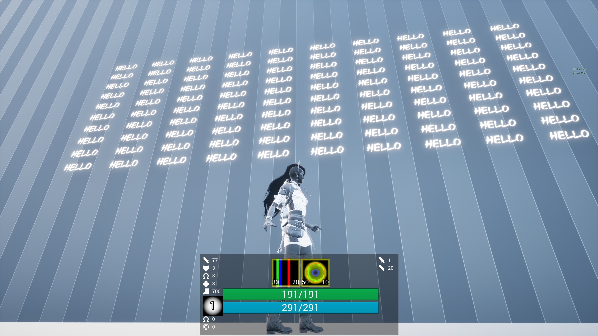
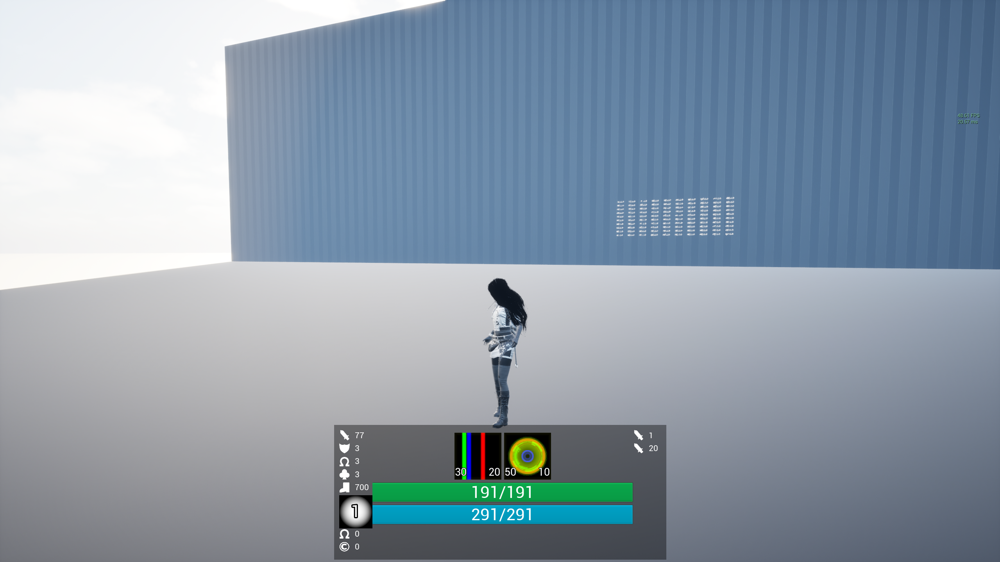
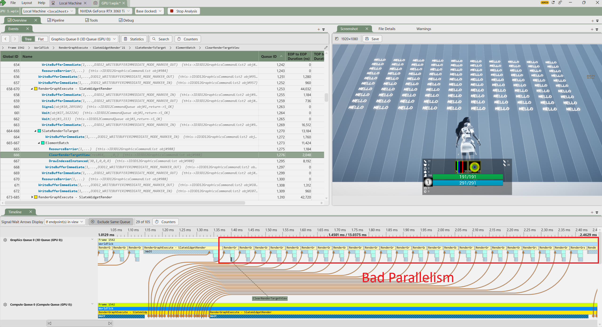
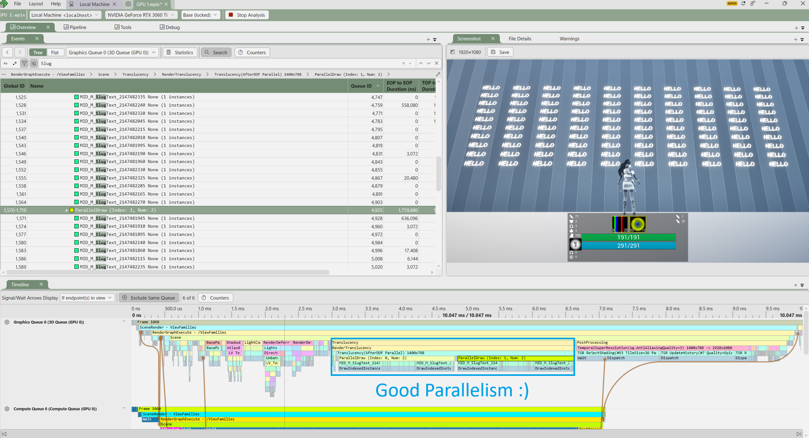
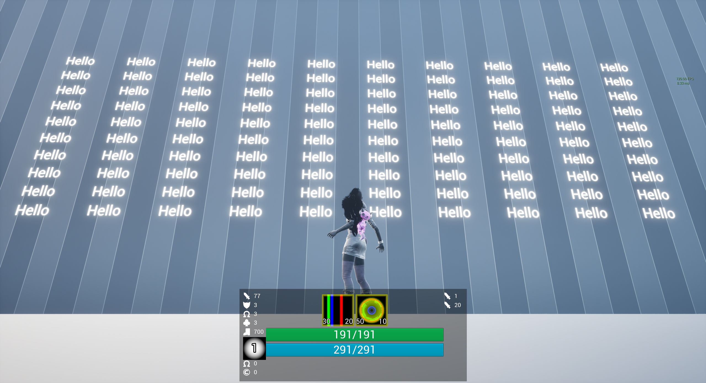

# 동기와 목표

언리얼 엔진에서 3D 텍스트를 렌더링하는 두 가지 방법을 알아보자.

첫 번째는 월드에 `UTextRenderActor`를 배치하는 방법이다. 내부적으로는 `UTextRenderComponent`가 실제 렌더링을 담당하며, 폰트 에셋으로부터 텍스트 지오메트리를 생성한다. 보통 오프라인으로 캐시된 글리프(glyph)를 사용하는데, 이는 글리프들이 미리 폰트 아틀라스 텍스처에 래스터화되어 있다는 뜻이다. 조악한 게 문제다:

벽에 있는 발광 텍스트들을 보라. 디테일이 사라지고, 얇은 글리프는 제대로 렌더링되지 않는다. 받아들일 수 없다. 그럴듯한 결과를 얻으려면 폰트 에셋의 알 수 없는 옵션들을 이리저리 만지고, 폰트를 다시 임포트하고, 결과를 확인하고, 괜찮아보일 때까지 반복해야 한다. 시간을 잡아먹는 과정이며, 높은 비주얼 퀄리티의 레벨을 만들 때에는 특히 골치 아프다.

다른 방법으로는, 월드에 `UWidgetComponent`를 그리는 방법이 있다. 이 역시 글리프를 미리 래스터화함에도 어째선지 품질이 더 나아 보이지만, 그 나름의 문제들을 안고 있다. `UWidgetComponent`는 Slate/UMG 위젯을 렌더 타겟에 렌더링한 뒤, 그 렌더 타겟을 월드 안에 그린다. 설정에 따라 다르지만, 이 위젯은 매 프레임 렌더링될 수도 있다. 상호작용도 하지 않는 단순한 텍스트 조각을 위해서는, 과잉이다. 텍스트 조각이 많다면, 위젯마다 별도의 렌더 타겟을 유지해야 하고 이에 따른 비용이 발생한다. 이 비용은 추후에 다룬다.

문제가 보인다. 중간이 없다. 따라서 직접 3D 텍스트 플러그인을 만들어보기로 했다. 목표는 다음과 같다: **아티스트가 텍스트를 그냥 배치해도 될 만큼 빠르면서도, 폰트의 퀄리티를 유지하는 것.**

# 사전 지식

타이포그래피(typography)와 텍스트 렌더링에 대한 기본적인 이해가 있어야 지금부터 하는 이야기를 온전히 이해할 수 있을 것이다. 컴퓨터 그래픽스에 대한 친숙함도 다소 요구된다.

# 슬러그(Slug)

*Better Software Conference 2026*에서 *슬러그(Slug)*에 대해 알게 되었다. *슬러그*는 미리 래스터화된 글리프 텍스처, 즉, 아틀라스(atlas)에 의존하는 대신, 렌더링 시점에 베지어(Bézier) 곡선으로부터 글리프 윤곽선을 직접 평가하는 GPU 기반 텍스트 렌더링 기법이다. 덕분에 텍스트가 크게 확대되거나 비스듬한 각도에서 보여도 세밀한 디테일이 보존된다.

슬러그는 *Ubisoft*, *Blizzard*를 비롯한 주요 게임 스튜디오들이 상업적으로 사용해왔다. 2026년에 라이선스 상태가 바뀌면서 이 프로젝트에 이 기술을 쓸 수 있게 되었다. 글리프 아틀라스를 미리 구워두고 그게 어떤 크기와 각도에서도 버텨주길 기도하지 않아도 된다. 완벽하다.

# LLM

언리얼 엔진은 비대한 코드베이스이고, 그 렌더링 파이프라인을 제대로 파헤쳐본 적이 없었다. 이제는 언리얼 엔진 소스 코드를 더 깊이 이해할 때가 됐다고 느꼈고, 시작하는 데 있어 LLM이 큰 도움이 됐다. 또, HarfBuzz와 FreeType의 난해한 코드들을 다시 작성하려니 머리가 지끈해져서 LLM에 이 또한 의존하였다.

# 게임에서 렌더러까지

월드에 3D 텍스처 액터를 그리고 싶었기 때문에, 포스트 프로세싱 이후에 처리되는 글로벌 셰이더나 RDG보다는 버텍스 팩토리(vertex factory) 쪽이 낫다.

퍼즐 조각들을 하나씩 살펴보자.

`FStaticMeshVertexBuffers`는 `PositionVertexBuffer`, `ColorVertexBuffer` 같은 버텍스 속성 버퍼들을 SOA 형태로 캡슐화하며, 각 버텍스 버퍼는 RHI 리소스를 캡슐화하고 관리하는 `FRenderResource`를 상속한다. RHI는 *Render Hardware Interface*의 줄임말로, Direct3D 11, 12, Vulkan 같은 그래픽스 API 위에 놓인 하나의 레이어일 뿐이다. 읽는데 어지럽더라도 필자를 탓하지 말길 바란다. 어쩔 수 없다. 

`VertexFactory`는 CPU 쪽에서 지정한 버텍스 레이아웃을 따라 GPU에 버텍스 버퍼를 할당한다. 대부분의 메쉬 컴포넌트는 `FLocalVertexFactory`를 사용한다. `LocalVertex`는 위치, 텍스처 좌표, 색상, 탄젠트를 속성으로 가진다. *Eric Lengyel*이 직접 GitHub에 올려둔 샘플 셰이더 코드가 요구하는 속성을 모두 갖추고 있으므로 이것을 사용하기로 했다.

글리프 하나당 버텍스 4개, 인덱스 6개. 별다른 건 없다. UV0는 글리프 자체의 디자인 공간 좌표를 담고, UV1은 머티리얼이 달리 받을 방법이 없는 두 숫자, 즉 이 글리프의 컨트롤 포인트가 커브 텍스처의 어디서부터 시작하는지, 그리고 몇 개나 있는지를 몰래 실어 나른다. `FDynamicMeshVertex`는 이미 네 개의 채널을 갖고 있다. 깔끔하다.

`FPrimitiveSceneProxy`를 상속하는 `FSlugTextSceneProxy`는 렌더러에게 그릴 것을 건네준다. 버텍스 버퍼, 인덱스 버퍼, 버텍스 팩토리, 그리고 컴포넌트의 머티리얼 슬롯에 무엇이 들어있든 그로부터 한 번 계산된 `FMaterialRelevance`를 소유한다. 한 번 구워지고 나면 이 중 어떤 것도 다시 바뀌지 않는다. 그 이후로 유일하게 손이 닿는 부분은 커브 텍스처뿐이고, 그것도 이전에 본 적 없는 글리프가 나타날 때뿐이다.

# 폰트 에셋에서 픽셀까지

폰트 폴백은 코드포인트(codepoint)마다 폴백 체인(fallback chain)을 따라가는 과정이다. 한 문단 안에서 같은 폰트 페이스(font face)로 떨어지는 연속된 코드포인트들은 하나의 런(run)으로 묶이는데, 이 덕분에 합자(ligature)나 한글 조합이 가능해진다. 이후 HarfBuzz를 통해 런을 셰이핑(shaping)하면, 각 글리프의 폰트 내에서의 인덱스(index), 클러스터(cluster), 어드밴스(advance) 및 오프셋(offset)을 얻을 수 있다.

이후, FreeType으로 각 글리프의 윤곽선을 추출한다. *슬러그*에는 2차 곡선만 입력값으로 받아들이므로, 3차 곡선 구간은 두 접선을 교차시켜 그 교차점을 새로운 단일 컨트롤 포인트로 삼는 방식으로 들어오는 도중에 근사된다. 이 코드는 FreeType의 구조체에 콜백으로 등록되어 `FT_Outline_Deceompose` 도중 호출된다. 서로 다른 글리프 각각은, 폰트와 글리프 인덱스로 키가 매겨진 채, 어디서 얼마나 자주 등장하든 상관없이 윤곽선 컨트롤 포인트를 정확히 한 번만 얻는다. 여기서 나오는 모든 컨트롤 포인트는 하나의 공유된 float 텍스처에 순서대로 추가된다.

머티리얼에 Custom 노드를 통해 삽입된 `SlugCoverage.ush`에서 버텍스 셰이더는 이 글리프가 몇 개의 컨트롤 포인트를 가지고 있는지 읽어들이고, 커버되는 모든 픽셀에 대해 $[0,1]$내의 커버리지(coverage)를 계산하고 반투명 패스(translucency pass)에서 알파(alpha) 값으로 사용된다.

# 성능

100개의 *슬러그* 텍스트 박스와, 100개의 `UWidgetComponent`를 비교해봤다. 둘 다 붓놀림의 디테일이 있는 복잡한 폰트를 사용했고, 이는 커브 수가 늘어날수록 연산이 무거워지는 *슬러그*에게 핸디캡으로 작용했다. `UWidgetComponent`는 그저 글리프 아틀라스를 샘플링할 뿐이기 때문에 상관 없다.

그럼에도 *슬러그*가 평균 20 FPS 이상 앞서며 승리를 가져갔다. 연산량이 무겁지 않나 싶어서 처음엔 반신반의했지만, 연

`UWidgetComponent`에서 흥미로웠던 점 하나는, 카메라가 뒤로 물러남에 따라, 화면상의 텍스트가 아무리 작아져도 성능에는 사실상 차이가 없었다는 것이다. 알고 보니 샘플링과 래스터화 비용이 `UWidgetComponent` 성능의 핵심이 아니었다.

<figure><figcaption>48 FPS</figcaption></figure>
<figure><figcaption>48 FPS</figcaption></figure>

그래픽스 큐는 컴퓨트 큐가 작업을 끝냄에 따라 비로소 해당 렌더 타겟을 클리어하고, 글리프 아틀라스를 샘플링하고, 렌더 타겟에 그릴 수 있다. 렌더 타겟을 바인딩하고, 클리어하고, 쓰는 작업은 병렬화할 수 없는 작업들이다. 각각이 하나의 독립된 패스다. 이렇게 순차적인 *N*개의 과정이 "진짜" 비용이었다.

반면 *슬러그* 구현은 병렬화가 가능하다. 또한 커버리지가 픽셀 단위로 계산되기 때문에, 연산 비용은 텍스트가 화면에서 차지하는 면적에 따라 달라진다. 마땅히 그래야 하듯, 화면에서 작게 보이는 텍스트는 비용이 극히 적다.

쐐기를 박기 위해, 비교적 단순한 *Roboto* 폰트로도 테스트해봤다. *슬러그*는 안정적인 120 FPS를 유지했고, `UWidgetComponent`는 차이가 없었다.

<figure><figcaption>확실한 120 FPS</figcaption></figure>

# 마무리

슬러그의 성능은 폰트의 복잡도에 크게 좌우되므로, 디테일이 많은 폰트를 사용한다면 성능을 확인해볼 필요성이 있다. 그냥 개선된 `TextRenderActor`를 만드는 편이 나았을려나 싶기도 했지만, 확실히 *슬러그*가 가장 좋은 퀄리티를 낸다. 필요 이상으로 큰 망치로 문제를 꽝 때리고 덮어둔다고 생각하자.

플러그인 내 대다수의 코드는 HarfBuzz와 FreeType을 둘러싼 수고와, 이런저런 데이터 처리이다. 여기서 진짜 건질 만한 지식은 역시 알고리즘 그 자체라고 생각한다. 이 기저의 기술은 필자의 것이 아니다. 모든 공은 *Eric Lengyel*에게 돌아간다. 본인은 그저 그의 논문을 바탕으로 퍼즐 조각들을 조립했을 뿐이다.

<figure><figcaption>훌륭한 퀄리티</figcaption></figure>

# 참고 자료

- Eric Lengyel, [*GPU-Centered Font Rendering Directly from Glyph Outlines*](https://jcgt.org/published/0006/02/02/paper.pdf), Journal of Computer Graphics Techniques, Vol. 6, No. 2, 2017.
- [EricLengyel/Slug](https://github.com/EricLengyel/Slug) — 슬러그 알고리즘의 레퍼런스 버텍스/픽셀 셰이더.
- Eric Lengyel, [*A Decade of Slug*](https://terathon.com/blog/decade-slug.html) — 슬러그를 무료로 사용할 수 있게 만든 2026년 특허 포기 선언.