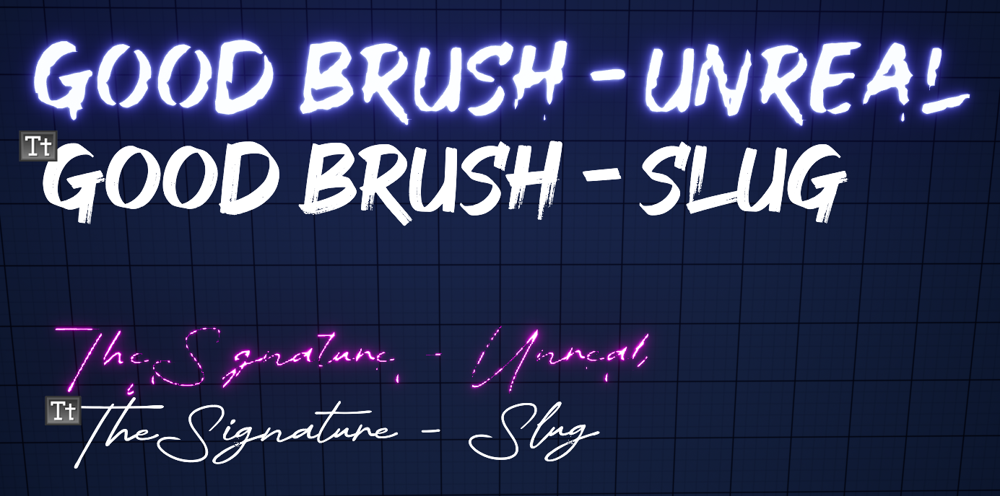
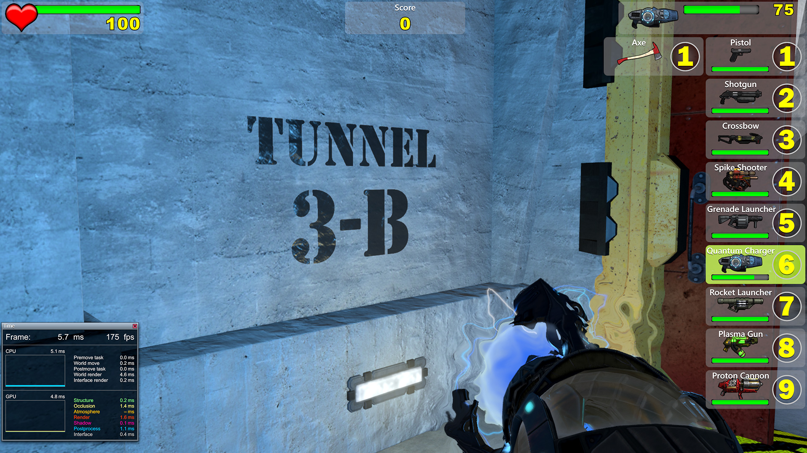
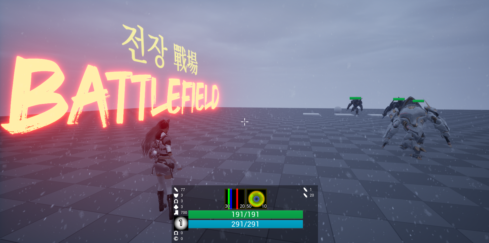

This is a draft.

# Motivation and Goals

Let me introduce two particular ways to render 3D text in Unreal Engine. 

The first is placing a `UTextRenderActor` in the world. Under the hood, the actual rendering is handled by `UTextRenderComponent`, which generates text geometry from a font asset. One of the available font workflows uses offline-cached glyphs, meaning the glyphs are pre-rasterized into onto font atlases textures ahead of time. Here's the problem:

Just look at the emissive text on the wall. Details are lost, and thin glyphs don't render correctly. It's intolerable. To get decent results, one must fight through a cryptic collection of options in the font asset, reimport the font, check the result, and repeat until it looks "fine". It's an ad hoc, time-consuming process, and it's especially annoying when you're trying to maintain a high visual standard while designing a level. 

Alternatively, you can draw `UWidgetComponent` in the world. It's crisp, but that comes with its own problem. A `UWidgetComponent` renders a Slate/UMG widget into a render target, which is then disdplayed as a surface in the world. Depending on its redraw settings, that widget may be rendered every frame. That's overkill, in my opinion, for a simple non-interactable piece of text. I don't want to pay the overhead of rendering every simple text element into a render target just to display it in the 3D world. If you have many pieces of text, maintaining a separate render target for each widget can make the approach even less attractive. 

See the problem? There is no in-between. So, I decied to roll my own 3D text plugin. First, let's set the goals:

1. Preserve the detail of the original font
2. Render thin glyphs correctly
3. Faster than `UWidgetComponent`

# Prerequisites

In my opinion, a basic understanding of typography and text rendering is necessary to fully grasp what's going on. Familiarity with computer graphics helps as well. 

# Slug

I learned about *Slug* at the *Better Software Conference 2026*. *Slug* is a GPU-based text-rendering technique that evaluates glyph outlines directly from Bézier curves at render time rather than relying on pre-rasterized glyph textures. This allows it to preserve fine details even when text is viewed at large sizes or from oblique angles.

Slug has been used commercially by major game studios, including *Ubisoft* and *Blizzard*. Its licensing status changed in 2026, making it possible for me to use the technology for this project. Instead of baking a glyph atlas ahead of time and hoping it survives whatever size and angle the text happens to be viewed at, I can evaluate the original vector outlines directly during rendering. Perfect.

# LLM

Unreal Engine is indeed one gigantic codebase, and I had never really dug into its rendering pipeline before. I felt like it was finally time to step up and get a better grasp of Unreal's source code, and I found LLMs to be surprisingly helpful in getting me started. Because of their non-deterministic and speculative nature, I generally try to avoid relying on LLMs for programming. But in this case, all I needed was a starting point. For that, it turned out to be useful, and I've got to give credit to LLMs this time.

# Game to Renderer

As I wanted to draw a 3D texture actor in the world, vertex factory seems better than global shader and RDG which is done after the post processing. 

Let's take a look at each puzzle piece. 

`FStaticMeshVertexBuffers` encapsulates vertex attribute buffers like `PositionVertexBuffer` and `ColorVertexBuffer` in SOA, and each vertex buffer inherits `FRenderResource`, which encapsulates and manages RHI resource. For those who arent' familiar, RHI is short for *Render Hardware Interface*, which is just a layer top of graphics APIs, such as Direct3D 11, 12, or Vulkan. Don't blame me. It is what it is.

`VertexFactory` allocates vertex buffer in the GPU, following the vertex layout specified on the CPU side. Most mesh components use `FLocalVertexFactory`. `LocalVertex` has position, texture coordinates, color and tangents as its attributes. We'll be using this as it needs all the attributes specifieid in the sample shader code provided by *Eric Lengyel* himself on GitHub.

Four vertices and six indices per glyph. Nothing fancy. UV0 carries the glyph's own design space coordinates, and UV1 smuggles in the two numbers the material has no other way to receive: where in the curve texture this glyph's control points start, and how many of them there are. `FDynamicMeshVertex` already ships with four channels. Neat.

All of it gets tied together in `FSlugTextSceneProxy`, which derives `FPrimitiveSceneProxy`. It hands the renderer something to draw. It owns the vertex buffers, the index buffer, the vertex factory, and a `FMaterialRelevance` computed once from whatever material happens to be sitting in the component's material slot. None of this moves again once it's baked. The only thing that ever gets touched afterward is the curve texture, and only when a glyph shows up that hasn't been seen before.

# Font Asset to Pixel

Font fallback is resolved first, per codepoint, by walking the fallback chain, since HarfBuzz has no notion of fallback. Consecutive codepoints in a paragraph that land on the same face are grouped into a run, which makes ligatures or Hangul composition possible. Shaping a run then gives every glyph its index, cluster, and advance/offset immediately, with no knowledge yet of line width. 

Line-breaking is a separate step. It decides where to cut the glyph stream into lines, using break candidates ICU found up front. Only after that does layout hand off line/advance data to build each glyph's quad in the vertex buffer. 

FreeType outputs outline for each glyph. Only quadratics can be fed into *Slug*, so a cubic segment are approximated on the way in by intersecting their two tangent lines and using that intersection as the new, single control point. This code is bind as a callback in FreeType's structure and called during `FT_Outline_Deceompose`. Each distinct glyph gets it outline control points exactly once, keyed by font and glyph index, independent of where or how often it appears. Every control point that comes out of this gets appended one to one shared float texture. 

None of that curve math has actually run yet by the time a pixel gets shaded. `SlugCoverage.ush`, pulled into the material through a Custom node, reads however many control points the vertex shader says this particular glyph owns, and for every covered pixel, walks those curves and decides, from the real, exact outline and not a cached approximation of it, whether that pixel sits inside the glyph or outside it. No atlas, no baked bitmap, just curve math, every pixel, every frame.

# Wrapping Up

After all, it was just handful of elbow grease around HarfBuzz and FreeType, along with the usual C++isms, OOP, and cryptic, undocumented, who-knows-what Unreal Engine code. I'd say the algorithm is the real juice, the "real" knowledge worth taking away from this.

None of the underlying technique is mine. All credit for that goes to *Eric Lengyel*. I simply worked out from his paper and assembled the puzzle pieces. 

