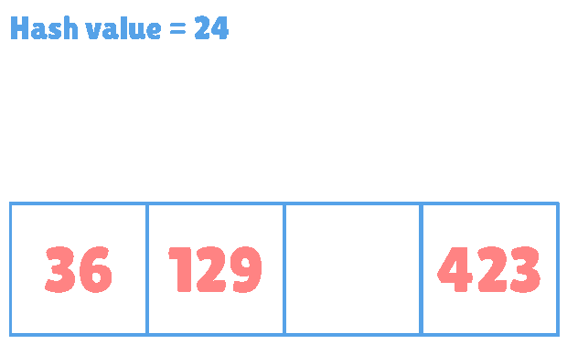

*Image from [libertygames](https://www.libertygames.co.uk), courtesy of Stuart Kerr*

---

해시 테이블에서 이차 탐사 함수로 삼각수를 사용할 수 있다. 구글의 *sparse hash*, *dense hash* 뿐 아니라, *Jai* 언어에서 채택된 이후 약 10%의 성능 향상을 보였다는 이야기를 듣고 흥미를 가지게 되었다. *Fabian Giesen*의 방법을 따라, 본 글에서는 **어떻게 삼각수가 $2^{m}$ 크기의 오픈 해시 테이블의 모든 슬롯을 정확히 한 번씩 방문하는지**를 다룬다.

---

## 삼각수
삼각 랙 안의 당구공 수를 한 줄씩 더해보자. $0,1,3,6,10\cdots$. 이 수들이 **삼각수**이다. 즉, ${k}$번째 삼각수는 다음과 같다.

$$T_{k} = \dfrac{k\mathrm{(}k + 1\mathrm{)}}{2}$$

최고차항 $\dfrac{k^{2}}{2}$은 이차항이므로 이차 탐사를 만족한다. $2^{m}$ 크기의 해시 테이블에서 탐사 함수 $f$는 다음과 같다.

$$f_{m}\mathrm{(}k\mathrm{)} = T_{k}\mskip6mu\operatorname{mod}2^{m}$$

예를 들어보자. 테이블의 크기가 $4$면 $4 = 2^{m}$이므로 $m = 2$이고, $k$는 $0$부터 $2^{m} - 1$까지의 수이다. 표를 통해 관찰해보자.

<table>
<tr>
 <td>$k$</td>
 <td>$0$</td>
 <td>$1$</td>
 <td>$2$</td>
 <td>$3$</td>
 <td>$4$</td>
 <td>$5$</td>
 <td>$6$</td>
 <td>$7$</td>
 <td>$8$</td>
 <td>$9$</td>
 <td>$10$</td>
 <td>$11$</td>
</tr>

<tr>
 <td>$T_{k}$</td>
 <td>$0$</td>
 <td>$1$</td>
 <td>$3$</td>
 <td>$6$</td>
 <td>$10$</td>
 <td>$15$</td>
 <td>$21$</td>
 <td>$28$</td>
 <td>$36$</td>
 <td>$45$</td>
 <td>$55$</td>
 <td>$66$</td>
</tr>

<tr>
 <td>$T_{k}\,\,\operatorname{mod}4$</td>
 <td>0</td>
 <td>1</td>
 <td>3</td>
 <td>2</td>
 <td>2</td>
 <td>3</td>
 <td>1</td>
 <td>0</td>
 <td>0</td>
 <td>1</td>
 <td>3</td>
 <td>2</td>
</tr>
</table>

패턴이 보인다. $0,1,3,2$ 이후 뒤집어서 $2,3,1,0$, 다시 뒤집어서 $0,1,3,2$가 반복된다.

해시 테이블 크기가 $4$인데 왜 뒤까지 보나면, 이후 증명에서 방금 관찰한 대칭성을 사용하기 때문이다. 

크기가 4일 때의 탐사 과정을 살펴보자.

한 줄 요약하면, $2^{n}$ 크기 테이블에서 삼각수를 통해 빠짐 없이, 중복 없이 순회할 수 있다. 나머지 파트는 이를 증명한다.

---

## 증명

최종목표는 $T_{k}\mskip3mu\operatorname{mod}2^{m}$는 집합 {$\mathrm{\{}0,1,\cdots,2^{m} - 1\mathrm{\}}$}의 순열(permutation)임을 증명하는 것이다.

### $(a)$
대칭하는 두 삼각수의 차를 살펴보고 $T_{k}\mskip3mu\operatorname{mod}n$의 대칭성을 증명한다.  ($n = 2^{m}$)

$$T_{2n - 1 - k} - T_{k} = \dfrac{\mathrm{(}2n - k\mathrm{)(}2n - \mathrm{(}k + 1\mathrm{))}}{2} - \dfrac{\mathrm{(}k + 1\mathrm{)}k}{2} = 2n^{2} - n\mathrm{(}2k + 1\mathrm{)}$$
$$T_{2n - 1 - k} - T_{k}\equiv0\mathrm{(}\operatorname{mod}n\mathrm{)}$$

또,
$$T_{2n - 1 - k} - T_{k}\equiv - n\left(\operatorname{mod}2n\right)$$

### $(b)$
$T_{k}\mskip3mu\operatorname{mod}n$이 $2n$의 주기를 가짐을 증명한다. ($n = 2^{m}$)

$$T_{a + b} = T_{a} + T_{b} + ab$$

위 항등식에 따라,

$$T_{k + 2n} = T_{k} + T_{2n} + 2kn = T_{k} + n\mathrm{(}2n + 1\mathrm{)} + 2kn\equiv T_{K}\mskip4.5mu\mathrm{(}\operatorname{mod}n\mathrm{)}$$
$$T_{k + 2n} \equiv T_{k}\mskip4.5mu\mathrm{(}\operatorname{mod}n\mathrm{)}$$

### $(c)$
$T_{k}\mskip3mu\operatorname{mod}2^{m}$는 집합 {$\mathrm{\{}0,1,\cdots,2^{m} - 1\mathrm{\}}$}의 순열임을 *수학적 귀납법*을 통해 증명한다.

$\mathrm{(}i\mathrm{)} \mskip4.5mu m = 0$일 때, $T_{k}\operatorname{mod}1 = 0$이고 집합은 {$0$}이므로 만족한다.

$\mathrm{(}ii\mathrm{)} \mskip4.5mu m = k$일 때 성립한다고 가정하면, $T_{k}\mskip4.5mu\operatorname{mod}n$은 {$\mathrm{\{}0,1,\cdots,2^{k} - 1\mathrm{\}}$}의 순열이다. 

$m = k + 1$일 때, $T_{k}\mskip4.5mu\operatorname{mod}2^{m + 1}$의 절반, 즉, $\mathrm{[}0,2^{m} - 1\mathrm{]}$ 내의 수들은 $(ii)$에 따라 중복하지 않는다. $(a)$에 따라,

$$
T_{2n - 1 - k}\equiv T_{k} - n\mskip4.5mu\mathrm{(}\operatorname{mod}2n\mathrm{)}
$$

즉, 나머지 절반은 처음 절반과 겹치지 않으며, 들어있는 수들은 중복하지 않는다.

따라서, $T_{k}\mskip3mu\operatorname{mod}2^{m}$는 집합 {$\mathrm{\{}0,1,\cdots,2^{m} - 1\mathrm{\}}$}의 순열이다. ∎

---



---

### 레퍼런스
[Fabian Giesen — Triangular numbers mod 2^n](https://fgiesen.wordpress.com/2015/02/22/triangular-numbers-mod-2n/)  
Donald E. Knuth — The Art of Computer Programming, Volume 3