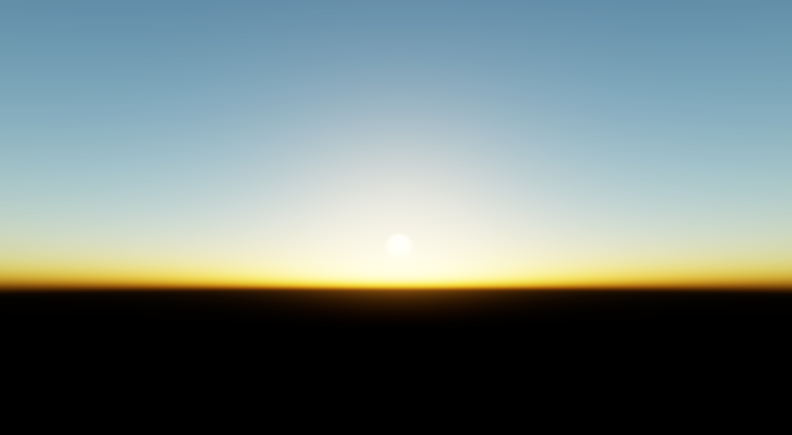

 [GitHub](https://github.com/raylee9919/RHI)
 [YouTube](https://www.youtube.com/playlist?list=PL4taYk3t6-W-ESLbZ57X5oiBSSvZgBzdQ)

## 개요

렌더링 파이프라인과 기술을 연구하고 구현한다.


## 렌더링

#### 환경

<details>
<summary>하늘 렌더링</summary>

을 통해 렌더링한 하늘")

[블로그 시리즈 보러가기](https://seongwoolee.com/ko/series/%ED%95%98%EB%8A%98-%EB%A0%8C%EB%8D%94%EB%A7%81/)

시간대에 따른 하늘 색 변화, 일출 및 일몰의 붉은 하늘, 태양 광원 주변의 광학 효과를 구현한다.

- lux, lumen 단위 제공
  - 아티스트에게 친숙한 단위를 제공함으로써, 조명 값을 직관적으로 설정할 수 있다.
- 실제 행성 반지름과 대기 두께
  - 실제 데이터로 다양한 행성을 표현 가능하다.
- 실제 태양 조도
  - $10^5$ lux 수준의 큰 값을, CCD 카메라와 HDR 렌더링 파이프라인에서 압축하여 구현하였다.

</details>

#### 후처리

<details>
<summary>HDR 톤 맵핑</summary>

HDR에 있는 렌더링 결과를 정규화된 값으로 전환해주는 과정이 필요. 이에, 아래 세 가지 톤 맵핑 함수를 지원.



가장 간단. 높은 밝기 값을 부드럽게 압축하여 HDR 이미지를 LDR 범위로 변환.
```hlsl
float3 tonemap_reinhard(float3 x) {
    return x / (x + 1.0f);
}
```


영화 산업의 모델을 근사. 강한 하이라이트와 높은 대비를 자연스럽게 표현.
```hlsl
float3 tonemap_aces(float3 x) {
    float a = 2.51;
    float b = 0.03;
    float c = 2.43;
    float d = 0.59;
    float e = 0.14;
    return saturate((x*(a*x+b))/(x*(c*x+d)+e));
}
```


Reinhard의 변형으로, 채도를 보다 잘 유지하면서 밝은 영역을 압축.
```hlsl
float3 tonemap_jodie_reinhard(float3 c) {
    // https://www.shadertoy.com/view/tdSXzD
    float luma = dot(c, float3(0.2126, 0.7152, 0.0722));
    float3 tc = c / (c + 1.0);
    return lerp(c / (luma + 1.0), tc, tc);
}
```




</details>

<details>
<summary>블룸</summary>

강한 강원을 바라볼 때, 이미지 센서의 전하 누출 현상을 모사한다.

- 컴퓨터 셰이더를 통한 다운 샘플링, 업 샘플링
- Karis Filter를 통해 "반딧불이 현상" 제거
- 세 가지 인자로 효과 조절
  - 임계값
  - 필터링 반경
  - 블룸 세기

레퍼런스</br>
[Call of Duty: Advanced Warfare(2014)](https://www.iryoku.com/next-generation-post-processing-in-call-of-duty-advanced-warfare/)

</details>


## 에셋

<details>
<summary>셰이더</summary>

JSON 메타데이터와 리플렉션을 기반으로 셰이더를 관리한다.

#### JSON 메타데이터

렌더 타겟, 깊이 버퍼, 컬링 모드, 셰이더 파일 경로 등을 정의.

```json {filename=gbuffer.json}
{
    "pipeline" : "Graphics",
    "name": "GBuffer",
    "shader": "$PROJECT$/Asset/Shader/HLSL/GBuffer.hlsl",
    "cull" : "back",
    "render_targets" : [
        "R32G32B32A32_FLOAT",
        "R8G8B8A8_SNORM",
        "R32G32_FLOAT",
        "R16_UINT"
    ],
    "depth_format" : "D32"
}
```

#### 바인드리스 렌더링

루트 시그니처를 하나의 상수 버퍼로 단순화하였다.

```hlsl {filename=gbuffer.hlsl}
struct Push_Constants {
    uint vertex_buffer_id;
    uint transform_id;
    uint material_id;

    uint transforms_id;
    uint camera_id;
    uint anisotropic_sampler_id;
};
ConstantBuffer <Push_Constants> push : register(b0);
```

#### 리플렉션

셰이더와 리소스 정보를 자동으로 추출하여 파이프라인 상태를 생성한다.

</details>


## 갤러리



