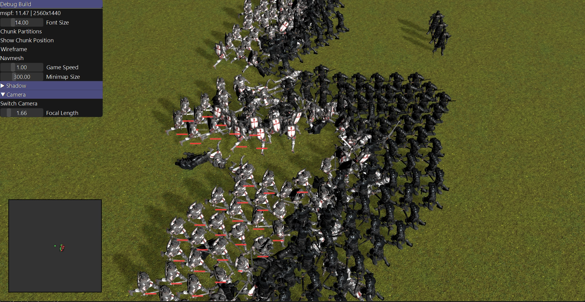



---

 [GitHub](https://github.com/raylee9919/rts)
 [YouTube](https://www.youtube.com/playlist?list=PL4taYk3t6-W82PICQ04Ep9R1qkEBrM0Ol)

## 개요

| 인원 | 기간 | 사용 기술 |
|:-----------|:------------|:------------|
| 1인  | 2024년 3월 ~  | C++17, OpenGL, GLSL |

RTS 게임 및 이를 위한 기능을 구현한 엔진

#pitch {
## 문제
Unity, Unreal 같은 범용 엔진은 대규모 RTS 시뮬레이션에 필요한 저수준 제어—커스텀 메모리 구조, 수백 유닛 단위의 결정론적 충돌·경로탐색, 인스턴싱 위주의 렌더링 파이프라인—를 추상화해 감춘다.

## 해결
C++17로 엔진을 처음부터 직접 구현했다. 커스텀 아레나 할당자와 SIMD 최적화 수학 라이브러리를 코어로, 민코프스키 합 기반 충돌 감지와 들루네 삼각분할 내비메시로 유닛 이동을, Cook-Torrance BRDF 기반 PBR 렌더러에 캐스케이디드 섀도 맵·인스턴싱·멀티스레드 스켈레탈 애니메이션을 더했다.

## 결과
아직 진행 중이다—플랫폼, 에셋, 렌더링, 시뮬레이션, UI 시스템이 엔드투엔드로 동작하고 있다. 진행 상황은 [GitHub](https://github.com/raylee9919/rts)와 [개발 로그 재생목록](https://www.youtube.com/playlist?list=PL4taYk3t6-W82PICQ04Ep9R1qkEBrM0Ol)에서 볼 수 있다.
}

## 주요 기능

#### 코어

- Windows 레이어
- 커스텀 메모리 관리 (아레나 할당자)
- SIMD 최적화 수학 라이브러리

#### 에셋 시스템

- 3D 에셋 임포트 파이프라인 (FBX, glTF, …)
- 텍스처 임포트 파이프라인 (PNG, JPG, …)

#### 렌더링

- Cook-Torrance BRDF
- 멀티스레드 스켈레탈 애니메이션
- 캐스케이디드 섀도 맵
- 인스턴싱

#### 시뮬레이션

- 민코프스키 합 기반 충돌 감지
- 들루네 삼각분할 기법 기반 내비메시 생성

#### UI

- 서브픽셀 폰트 렌더링 (ClearType)
- 다국어 지원

## 의존성

- stb-library
- ufbx
- meshoptimizer
- xxHash3
- Tracy
