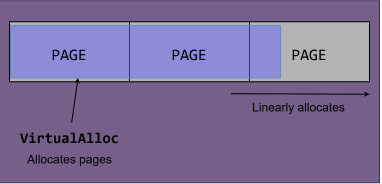
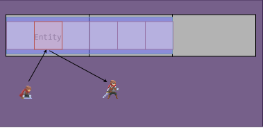
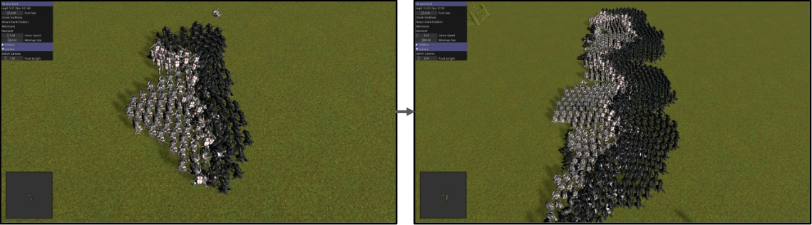
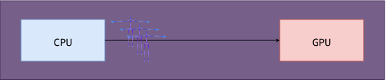
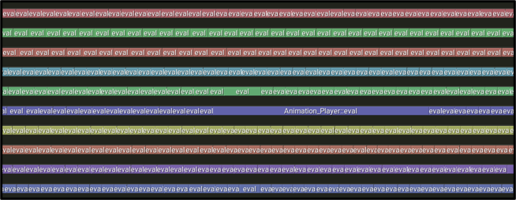
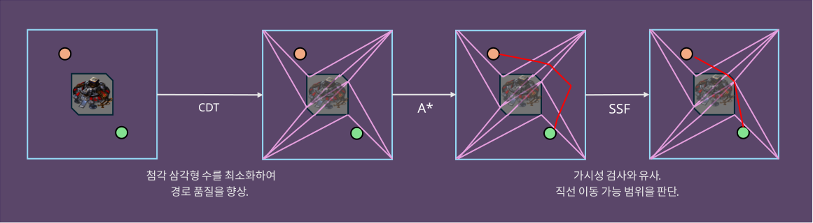



---

 [GitHub](https://github.com/raylee9919/rts)
 [YouTube](https://www.youtube.com/playlist?list=PL4taYk3t6-W82PICQ04Ep9R1qkEBrM0Ol)

## Overview

| Team | Duration | Stack |
|:-----------|:------------|:------------|
| 1  | Mar 2024 ~ | C++17, OpenGL |

A game engine focused on the RTS genre.

## Problem Solving

#slideshow {
    : align = "cc" {
        # Memory Management
    };

    Problem {
        Using the C++ standard library brought the following problems:

        - High overhead from <span class="hl">thousands to tens of thousands of
          malloc/free calls</span> per frame
        - <span class="hl">Cache-line-exclusive cost (x86 LOCK)</span> on every
          smart-pointer refcount update
        - <span class="hl">Performance variance</span> from many failure points
          plus OS scheduler intervention

        So the decision was to write a custom memory data structure from scratch.
    };

    Solving {
        Built a page-based <span class="hl">Arena allocator</span> with Windows
        `VirtualAlloc()` — reserving memory a page at a time and handing back
        addresses with nothing but stack-pointer movement.

        
    };

    Solving {
        Objects whose lifetime is exactly one frame are grouped together, and the
        allocator is reset wholesale at the start of every frame — constant-folding
        <span class="hl">N calls → 1</span> allocation/deallocation call.

        
    };

    Solving {
        Implemented a <span class="hl">Free List/Pool</span> to reuse previously
        allocated blocks, cutting allocation/deallocation overhead.

        
    };

    Solution {
        Both <span class="hl">rendering data processing</span> and <span
        class="hl">object management</span> improved over malloc/free:

        | µs/frame | malloc/free | Arena/Pool |
        |:-----------|:------------|:------------|
        | Rendering  | 106.12  | 14.88 |
        | Object mgmt  | 31.29  | 23.99 |
    };
};

#slideshow {
    : align = "cc" {
        # Rendering at Scale
    };

    Problem {
        Starting from 100v100 and scaling battle size further, frame drops appeared.

        
    };

    Solving {
        Root-caused it with CPU and GPU profilers, then used a <span
        class="hl">graphics debugger</span> to confirm the <span class="hl">geometry
        shader</span> stage of the Shadow Pass had poor parallelism. Switched to
        plain instanced rendering, improving it <span class="hl">15ms → 9ms</span>.

        
    };

    Solving {
        Mapped the GPU memory used for matrix updates on the CPU side for the
        lifetime of the game, removing <span class="hl">Map/Unmap and fence-sync
        cost</span> every frame. <span class="hl">Compressed 4x4 → 3x4
        matrices</span> for upload, improving bandwidth too.

        
    };

    Solving {
        CPU animation updates have no cross-unit dependency, so they run through
        <span class="hl">parallel for</span>, minimizing synchronization cost too.

        ```cpp
        template <typename F>
        void ParallelFor(Thread_Group& group, int64_t count, F&& func);
        ```

        
    };

    Solution {
        Achieved 60 FPS at 1000v1000.

        |  | Before | After |
        |:-----------|:------------|:------------|
        | Draw calls | 10,000  | 30 |
        | Shadow Pass  | 15ms  | 9ms |
        | 600 vs 600 | 30 FPS  | 100 FPS |
        | 1000 vs 1000 | ---  | 60 FPS |
    };
};

#slideshow {
    : align = "cc" {
        # Path Finding
    };

    Problem {
        <span class="hl">Path finding</span>, essential to an RTS, needed a <span
        class="hl">triangulation algorithm</span> underneath it. Considered an
        open-source library, but ran into:

        - No <span class="hl">deletion</span> operation, needed to punch out
          destroyed obstacles
        - <span class="hl">Heavy codebases</span> built mainly for things like
          geological simulation

        So the geometry library was written from scratch.
    };

    Solving {
        Implemented the algorithm as a pipeline:

        1. <span class="hl">Constrained Delaunay Triangulation</span> (CDT) generates the navmesh.
        2. <span class="hl">A*</span> computes the route.
        3. <span class="hl">Simple Stupid Funnel</span> simplifies it into a walkable path.

        
    };

    Solution {
        
    };

    Solution {
        Faster build and runtime than well-known alternatives, plus deletion support:

        |            |     Own        |    CGAL         | Triangle |
        |:-----------|:------------|:------------|-------------|
        | Build time (ms) | <span class="hl">748</span>  | 17,805 |  3,894 |
        | Deletion op      |  <span class="hl">O</span>  |  O  |  X  |
        | Runtime (ms) | <span class="hl">1.94</span>  | 1.82 | 3.84 |
    };

    Solution {
        Open-sourced the code on [GitHub](https://github.com/raylee9919/cdt);
        picked up 100+ stars.

        
    };
};
