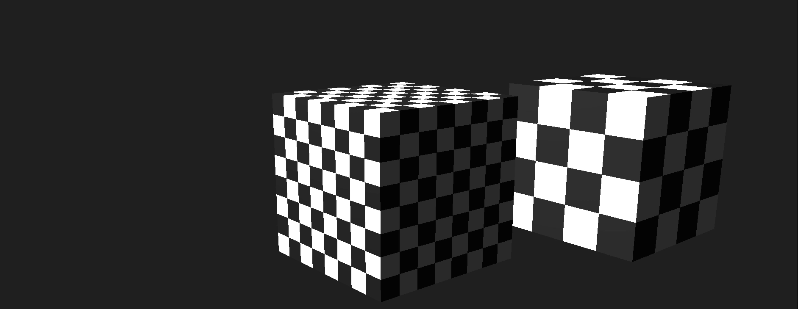
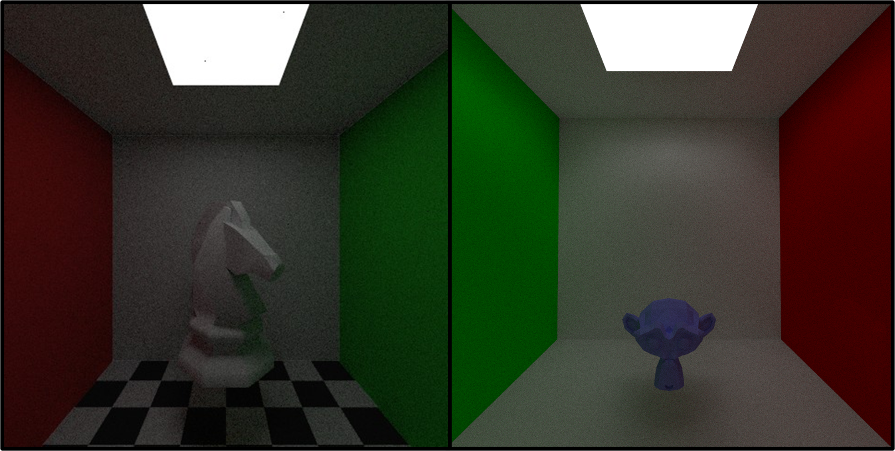
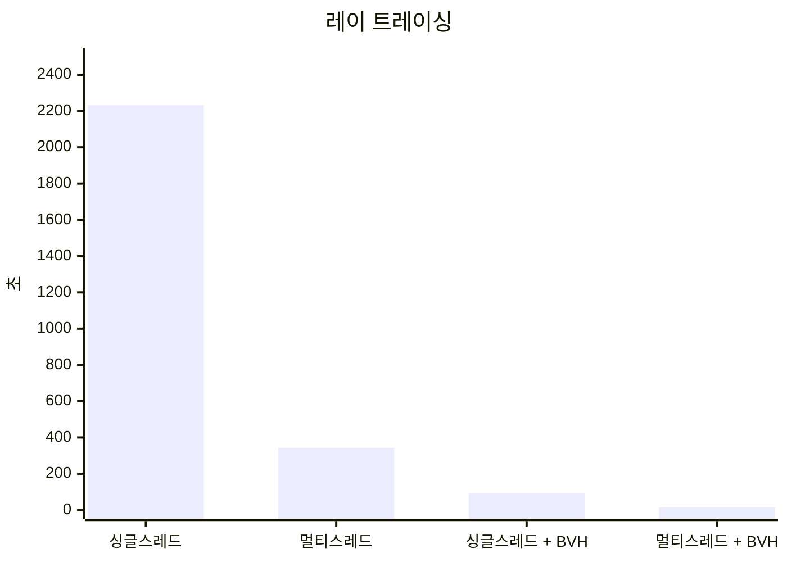

## 개요

| 인원 | 기간 | 사용 기술 |
|:-----------|:------------|:------------|
| 1인  | 2025년 12월 ~ 2026년 1월 | C++17 |

CPU 기반 소프트웨어 **래스터라이저**와 **레이트레이서**

# 래스터라이저

 [GitHub](https://github.com/raylee9919/sw-renderer)

**GPU 그래픽스 파이프라인**을 시뮬레이션합니다.

## 과정

#### 기하 단계

- 정점 변환 (모델 → 월드 → 클립)
- 퍼스펙티브 디바이드 및 뷰포트 변환

#### 래스터화

- 엣지 함수 기반 삼각형 래스터화
- 퍼스펙티브 보정 속성 보간
- 깊이 버퍼링 (z-test, z-write)

#### 픽셀 단계

- 텍스처 샘플링 및 필터링
- 픽셀 단위 라이팅

#### 블릿

- CPU 프레임버퍼에 결과 작성
- Win32 `BitBlt`를 통한 화면 출력

---------------------

# 레이트레이서

 [GitHub](https://github.com/raylee9919/sw-rt)

## 렌더링 모델

다음 세 가지 목표에 따라:

- 현실과 유사한 결과
- 합리적인 연산 비용
- 조정 가능한 파라미터

**Cook-Torrance BRDF** 채택.

$$
\frac{D \cdot F \cdot G}{4(\omega_l \cdot n)(\omega_v \cdot n)}
$$

$D$, $F$, $G$ 항은 **근사** 모델로, 물리적 특성을 유지하면서 연산 비용을 최소화한다.

## 가속

**BVH**와 **멀티스레드**로 성능을 **160**배 개선

