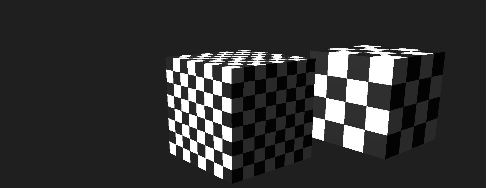
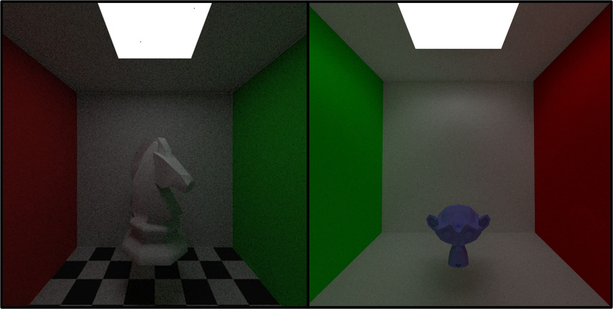

## 개요

| 인원 | 기간 | 사용 기술 |
|:-----------|:------------|:------------|
| 1인  | 2025년 12월 ~ 2026년 1월 | C++17 |

CPU 기반 소프트웨어 **래스터라이저**와 **레이트레이서**

# 래스터라이저

 [GitHub](https://github.com/raylee9919/sw-renderer)

**GPU 그래픽스 파이프라인**을 시뮬레이션합니다.

## 과정

**기하 단계** → **래스터화** → **픽셀 단계** → **블릿**

#### 기하 단계

- 정점 변환 (모델 → 월드 → 클립)
- 퍼스펙티브 디바이드 및 뷰포트 변환

#### 래스터화

- 엣지 함수 기반 삼각형 래스터화
- 퍼스펙티브 보정 속성 보간
- 깊이 버퍼링 (z-test, z-write)

#### 픽셀 단계

- 텍스처 샘플링 및 필터링
- 픽셀 단위 라이팅

#### 블릿

- CPU 프레임버퍼에 결과 작성
- Win32 `BitBlt`를 통한 화면 출력

---------------------

# 레이트레이서

 [GitHub](https://github.com/raylee9919/sw-rt)

#slideshow {
    {
        # PBR 렌더링 모델
    };

    문제 {
        현실과 유사한 결과를 유지하면서도, 근사 기법으로 연산 비용을 줄이고
        파라미터로 유연하게 제어할 수 있는 렌더링 모델이 필요했다.
    };

    해결 {
        아티스트가 제작한 모델과 PBR 텍스쳐를 물리적으로 일관되게 렌더링하기
        위해 Cook-Torrance BRDF를 채택했다.

        $$
        f = \frac{DFG}{4(\omega_o \cdot n)(\omega_i \cdot n)}
        $$

        $D$, $F$, $G$ 항에는 게임 산업에서 널리 쓰이는 Trowbridge-Reitz GGX
        NDF, Schlick Fresnel Approximation, Smith-Schlick G를 적용했다.
    };

    결과 {
        근사 모델을 사용함으로써 실제 물리 기반 반사 모델의 특성을 유지하면서
        연산 비용을 최소화했다.
    };
};

#slideshow {
    {
        # 가속
    };

    문제 {
        간단한 모델(삼각형 5,000개)임에도 렌더링에 약 40분이 걸렸다.
        광선-삼각형 교차 검사가 O(N)으로, 장면이 커질수록 연산 비용을
        감당할 수 없는 구조였다.
    };

    해결 {
        삼각형들을 공간적으로 계층화한 이진 트리 구조인 BVH를 구축해 광선과의
        불필요한 삼각형 교차 검사를 제거했다. 여기에 카메라의 필름 영역을
        스레드별로 분할하는 멀티스레드 작업 큐를 더했다 —
        InterlockedCompareExchange() 기반 락프리 큐에 세마포어로 유휴
        스레드를 재우고 깨워, 작업이 없을 때 CPU 자원을 낭비하지 않도록 했다.
    };

    결과 {
        BVH만으로 24배 (37분 → 1.5분), 멀티스레딩만으로 6배 (37분 → 6분)
        향상. AMD Ryzen 5 5600X 6-Core 기준, 둘을 결합하면 싱글스레드
        2233초 → 멀티스레드+BVH 14초로 총 **160배** 성능 향상을 달성했다.

        | 방식 | 시간 |
        |:---|---:|
        | 싱글스레드 | 2233초 |
        | 멀티스레드 | 343초 |
        | 싱글스레드 + BVH | 93초 |
        | 멀티스레드 + BVH | 14초 |
    };
};

