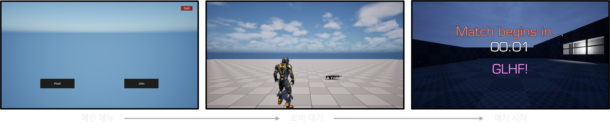
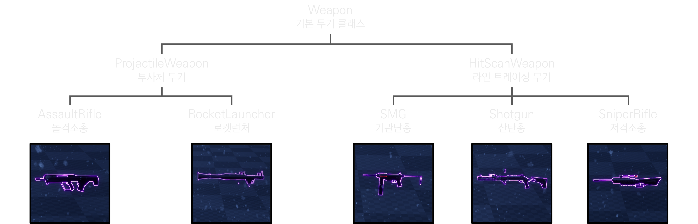
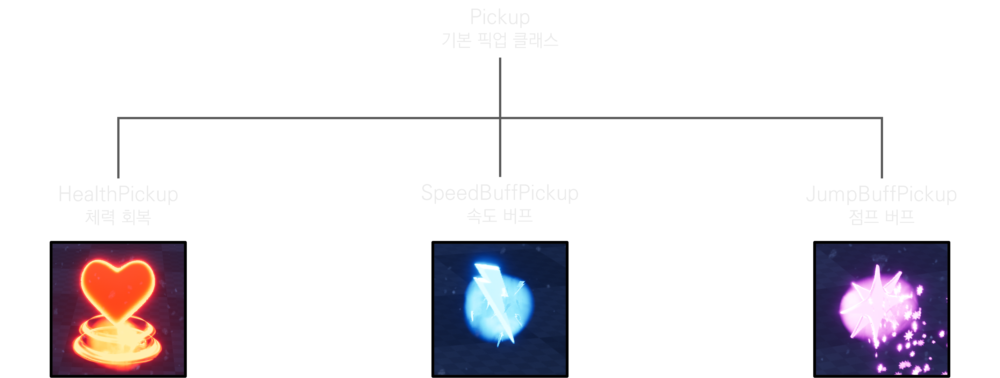



---

 [YouTube](https://www.youtube.com/playlist?list=PL4taYk3t6-W-jM5mpB3anSf0eX6Hcgjel)

## 개요

| 인원 | 기간 | 사용 기술 |
|:-----------|:------------|:------------|
| 1인  | 2026년 1월 ~ 2026년 4월 | UE5 |

## 주요 기능

### 네트워킹

- **온라인 서브시스템 스팀**을 통한 세션 생성 및 참가
- 체력, 점수, 게임 상태 동기화를 위한 프로퍼티 복제 (Replication)
- 권한 기반 명령 전달을 위한 RPC (Server, Client, NetMulticast)
- 게임 흐름:

### 게임플레이

- 1인칭 데스매치
- HUD에 체력 및 실드 표시
- 매치 타이머 및 플레이어별 킬/데스 추적

### 무기

### 픽업

